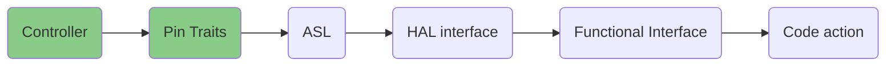

# Embedded Controller

An Embedded Controller is typically a single SOC (System on Chip) design capable of managing a number of low-level tasks.

These individual tasked components of the SOC are represented by the gold boxes in the diagram. The ODP Support for Embedded Controller development is represented in the diagram in the green boxes, whereas third party support libraries are depicted in blue.

The Open Device Partnership defines:
- An "owned interface" that communicates with the underlying hardware via the available data transport (UART, eSPI, IC2, IC3, shared memory).
- This interface supports business logic for operational abstractions and concrete implementations to manipulate or interrogate the connected hardware component.
- The business logic code may rely upon other crates to perform its functions. There are several excellent crates available in the Rust community that may be leveraged, such as [Embassy](https://embassy.dev/).
- Synchronous and asynchronous patterns are supported.
- No runtime or RTOS dependencies.

An implementation will look a little like this:

_For more, see..._

- legacy_ec_interface
