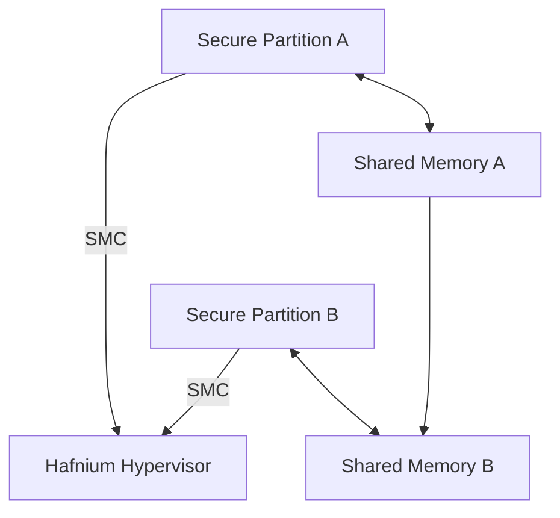

# Hafnium

The purpose of Hafnium is to provide memory isolation between a set of security domains, to better separate untrusted code from security-critical code. It is implemented as a type-1 hypervisor, where each security domain is a VM.

Hafnium is a type-1 hypervisor, meaning it runs directly on the bare metal hardware rather than being hosted by an underlying operating system (as with type-2 hypervisors like VirtualBox). This allows it to manage CPU and memory resources with minimal overhead, and to enforce strong isolation between security domains at the hardware level.

In an ODP system, where critical components may be implemented in Rust and less trusted components may be written in other languages or come from third parties, Hafnium allows these to coexist in separate Secure Partitions (akin to VMs). Each partition has its own memory space, and interaction between them is typically done via FFI, shared memory regions, or secure monitor calls (SMCs). This architecture ensures that even a compromised component cannot directly affect or read the memory of others—enforcing strong security boundaries with hardware support.

Hafnium is not a Rust implementation. It is a C++ based hypervisor maintained by the TrustedFirmware Organiziation.  An ODP implementation may use the exposed entry points of this API to interact with it for a secure implementation that isolates individual component code.

_This diagram shows the interaction between two partitions, isolated, communicating with Hafnium and optionally from A to B via shared memory._
