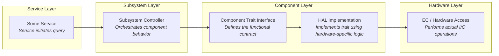
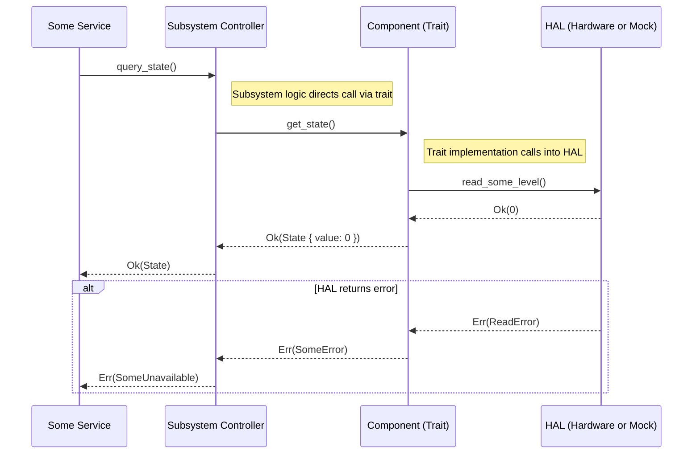
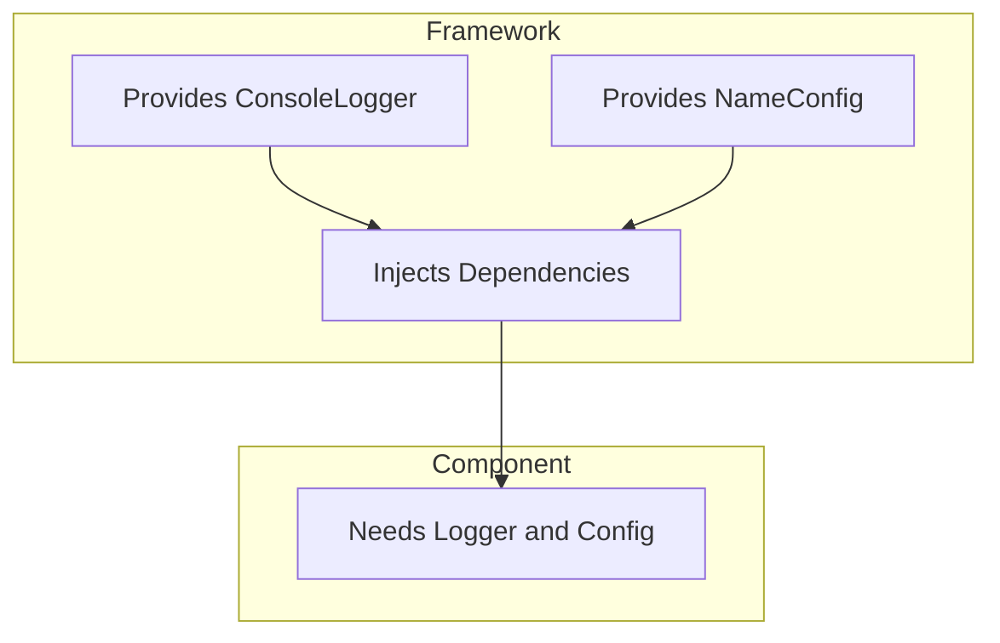

# Embedded Controller Architecture

The construction of a typical component under the control of a service subsystem looks as follows:

When in operation, it conducts its operations in response to message events

A core pattern of the ODP architecture is one of __Dependency Injection__.  The service and subsystem `Traits` define the functional contract of the component, while the HAL implementation provides the hardware-specific logic. This allows for a clear separation of concerns and enables the component to be easily tested and reused across different platforms. Components are eligible to be registered for their subservice if they match the required traits.

