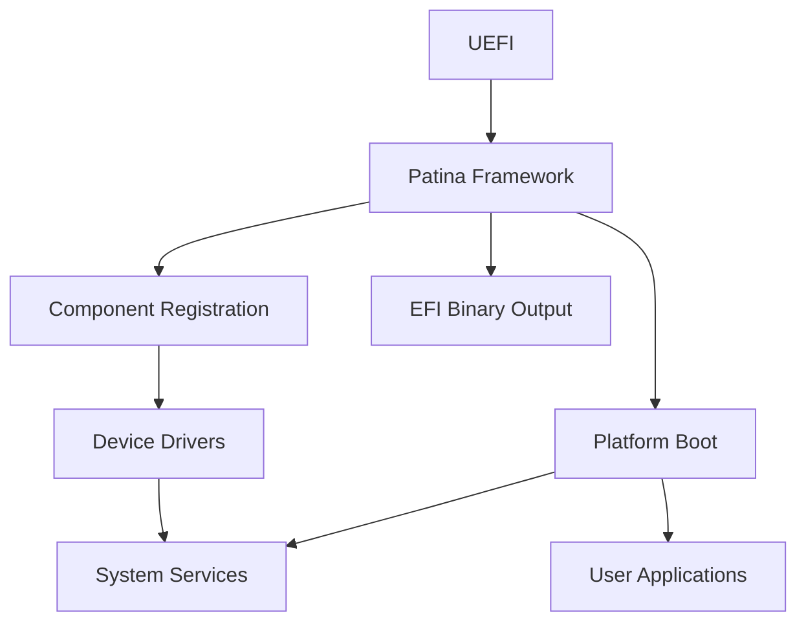

# Patina Framework Architecture

Traditional UEFI architecture describes a series of boot phases that are executed in a specific order to initialize the system and prepare it for use. The Patina framework is designed to fit within this architecture, specifically focusing on the DXE (Driver Execution Environment) phase.

Patina re-imagines the DXE phase as a framework for building modular, reusable components that can be dynamically loaded and executed. This approach allows for greater flexibility and agility in firmware development, enabling developers to create components that can be easily reused across different platforms and configurations.

> #### Figure: Patina Framework within UEFI Boot Phases

For architectural details, refer to the Patina [DXE Core documentation](https://github.com/OpenDevicePartnership/patina/blob/728c7e3a345a0a74351b14c1ff9a6bf948248fed/docs/src/patina.md#patina-dxe-core).

