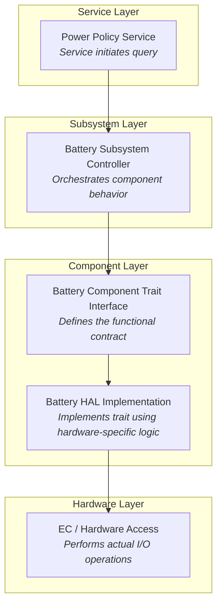

# Battery Service Registry

So far, we've defined our mock battery and wrapped it in Device wrapper so that it is ready to be included in a Service registry.

To do so meant committing to an embedded target build and a no-std environment compatible with the ODP crates and dependencies.

Now it is time to prepare the code we need to put this MockBatteryDevice to work.


### Looking at the examples
The `embedded-services` repository has some examples for us to consider already.  In the `embedded-services/examples/std` folder, particularly in `battery.rs` and `power_policy.rs` we can see how devices are created and then registered, and also how they are executed via per-device tasks.  The system is initialized and a runtime `Executor` is used to spawn the tasks.

There are a few tricks involved, though, because Embassy is normally designed to run in an embedded context, and we are using it in a std local machine environment.  That's fine.  In the end, we will build in such a way that we can define, build, and test our component completely before committing to an embedded target, and when we do there will only be minor changes required.

## 🔌 Wiring Up the Battery Service
We need to create a device `Registry` as defined by `embedded-services` to wire our `MockBatteryDevice` into.

To do this, let's replace our current `mock_battery/main.rs` with this:

```rust
use embassy_executor::Executor;
use static_cell::StaticCell;

use embedded_services::init;
use embedded_services::power::policy::{register_device, DeviceId};
use mock_battery::mock_battery_device::MockBatteryDevice;

static EXECUTOR: StaticCell<Executor> = StaticCell::new();
static BATTERY: StaticCell<MockBatteryDevice> = StaticCell::new();

fn main() {
    let executor = EXECUTOR.init(Executor::new());

    // Construct battery and extract needed values *before* locking any 'static borrows
    let battery = BATTERY.init(MockBatteryDevice::new(DeviceId(1)));

    executor.run(|spawner| {
        spawner.spawn(init_task(battery)).unwrap();
        spawner.spawn(battery_service::task()).unwrap();
    });
}


#[embassy_executor::task]
async fn init_task(battery:&'static mut MockBatteryDevice) {
    println!("🔋 Launching battery service (single-threaded)");

    init().await;

    println!("🧩 Registering battery device...");
    register_device(battery).await.unwrap();

    println!("✅🔋 Battery service is up and running.");
}

```

You should type `cargo run` and after it builds you should see this output:

```
     Running `target\debug\mock_battery.exe`
🔋 Launching battery service (single-threaded)
🧩 Registering battery device...
✅🔋 Battery service is up and running.
```

## Our main code
Our new main code does a few new important things.

1. It uses the static allocator and `StaticCell` to create single ownership of our component structures.
2. It initializes these `StaticCell` instances in `main`
3. It passes them into asynchronous tasks that execute upon them.

This pattern comes from the use of Embassy Executor and we will use it throughout the evolution of this example.

## The Battery Service
Now we have registered our battery device as a device for the embedded-services power policy,
but the `battery_service` also knows how to use a battery specifically to read the charge available, so we need to register our battery as a 'fuel gauge' by that definition.

### The fuel gauge
The battery service has the concept of a 'fuel gauge' that calls into the SmartBattery traits to monitor charge / discharge. 

We'll hook that up now.

Add this `use` statement near the top of your `main.rs` file:
```rust
use battery_service::device::{Device as BatteryDevice, DeviceId as BatteryDeviceId};
```

Then add this static declaration for our fuel gauge device service. Place it near the other statics for `EXECUTOR`, and `BATTERY`. 

```rust
static BATTERY_FUEL: StaticCell<BatteryDevice> = StaticCell::new();
```

add this task at the end of the file:
```rust
#[embassy_executor::task]
async fn battery_service_init_task(
    dev: &'static mut BatteryDevice
) {
    println!("🔌 Initializing battery fuel gauge service...");
    battery_service::register_fuel_gauge(dev).await.unwrap();
}
```
and we'll call it by placing this at the end of the `run` block in `main()`, below the other two task spawns, after
getting the id from the battery and initializing the fuel gauge.  So the new `main()` should look like:

```rust
fn main() {
    let executor = EXECUTOR.init(Executor::new());

    // Initialize our values one time
    let battery = BATTERY.init(MockBatteryDevice::new(DeviceId(1)));
    let battery_id = battery.device().id().0;
    let fuel = BATTERY_FUEL.init(BatteryDevice::new(BatteryDeviceId(battery_id)));

    executor.run(|spawner| {
        spawner.spawn(init_task(battery)).unwrap();
        spawner.spawn(battery_service::task()).unwrap();
        spawner.spawn(battery_service_init_task(fuel)).unwrap();

    });
}
```

Verify you can still build cleanly.  When you execute `cargo run` now, you should see output verifying our tasks have been run,
including our new fuel gauge service initialization task, with the line "🔌 Initializing battery fuel gauge service..."
```
     Running `target\debug\mock_battery.exe`
🔌 Initializing battery fuel gauge service...
🔋 Launching battery service (single-threaded)
🧩 Registering battery device...
✅🔋 Battery service is up and running.

```

>#### Why spawn all these individual tasks?
> This pattern may seem odd.  You may wonder "why run these as tasks instead of just calling them from main?"
> One reason is that these functions are asynchronous and must be called from an asynchronous context, so we need to 
> use the `Spawner` of the Embassy `Executor` to do that.
> The other is that each of these tasks form a self-contained mini-service that runs autonomously and may respond to signals
> to affect its behavior. 
> In `main` we are effectively launching a pre-configured set of cooperatively interacting agents with this pattern.


### Abstracting our thread model and types
Before we go much further, let's take some time to prepare for differences in our code we will need to deal with in the future as the code evolves to run in different contexts.
We will do two things in this regard: We will abstract our thread and sync model so that it will work in both a `std` and `no-std` environment and be compatible with _Embassy_ threading support, and we will declare some shorthand Types to simplify the definition of some of our Generic-defined constructs.

#### Creating `mutex.rs`
Create a new file that will define the imports and names for our Mutex-related support, depending on context.  Name this file `mutex.rs` and give it this content:
```rust
// src/mutex.rs

#[cfg(test)]
pub use embassy_sync::blocking_mutex::raw::NoopRawMutex as RawMutex;

#[cfg(not(test))]
pub use embassy_sync::blocking_mutex::raw::ThreadModeRawMutex as RawMutex;

// Common export regardless of test or target
pub use embassy_sync::mutex::Mutex;
```
This chooses different thread and sync models depending upon whether or not we are running in a test environment or a run environment.  This will be relevant when we turn our attention to unit testing, but we do it now to avoid having to refactor all the related code later.

#### Creating `types.rs`
Create a file named `types.rs` and give it this content:
```rust
// mock_battery/src/types.rs

use crate::mutex::RawMutex;
use embassy_sync::channel::Channel;
use battery_service::context::BatteryEvent;

pub type BatteryChannel = Channel<RawMutex, BatteryEvent, 4>;
```
This simplifies the definition of the `comms` `Channel` that we will be implementing next. It chooses the correct mutex via our new `mutex.rs` definitions, and establishes a `Channel` we will use for battery event communication.

#### Updating `lib.rs`
Add both of these files as modules in `lib.rs`:
```rust
pub mod mock_battery;
pub mod virtual_battery;
pub mod mock_battery_device;
pub mod mutex;
pub mod types;
```

### Implementing "comms"

The battery service is one of several services that may reside within the Embedded Controller (EC) micro-controller. In a fully integrated system, messages between the EC and other components — such as a host CPU or companion chips — are typically carried over physical transports like SPI or I²C.

However, within the EC firmware itself, services communicate through an internal message routing layer known as `comms`. This abstraction allows us to test and exercise service logic without needing external hardware.

At this point, we’ll establish a simple `comms` setup that allows messages to reach our battery service from other parts of the EC — particularly the power policy manager. The overall `comms` architecture can expand later to handle actual buses, security paging, or multi-core domains, but for now, a minimal local implementation will suffice.

#### The "espi" comms
We'll follow a pattern exhibited by the ODP `embedded-services/examples/std/src/bin/battery.rs`, but trimmed for our uses.

Create a file for a module named `espi_service.rs` inside your `mock_battery/src` folder and give it this content:

```rust
use battery_service::context::{BatteryEvent, BatteryEventInner};
use battery_service::device::DeviceId;
use crate::mutex::RawMutex;
use embassy_sync::signal::Signal;
use embedded_services::comms::{self, EndpointID, Internal, MailboxDelegate, MailboxDelegateError, Message};

use core::sync::atomic::{AtomicBool, Ordering};
use static_cell::StaticCell;

use crate::types::BatteryChannel;

pub struct EspiService {
    pub endpoint: comms::Endpoint,
    battery_channel: &'static mut BatteryChannel,
    _signal: Signal<RawMutex, BatteryEvent>
}
impl EspiService {
    pub fn new(battery_channel: &'static mut BatteryChannel) -> Self {
        Self {
            endpoint: comms::Endpoint::uninit(EndpointID::Internal(Internal::Battery)),
            battery_channel,
            _signal: Signal::new(),
        }
    }
}

// Forward BatteryEvent messages to the channel
impl MailboxDelegate for EspiService {
    fn receive(&self, message: &Message) -> Result<(), MailboxDelegateError> {
        // println!("📬 EspiService received message: {:?}", message);
        let event = message
            .data
            .get::<BatteryEvent>()
            .ok_or(MailboxDelegateError::MessageNotFound)?;

        // Forward the event to the battery channel    
        self.battery_channel.try_send(*event).unwrap(); // or handle error appropriately
        Ok(())
    }
}

// Actual static values
static INSTANCE: StaticCell<EspiService> = StaticCell::new();
// Create a cached global reference
static mut INSTANCE_REF: Option<&'static EspiService> = None;
static INSTANCE_READY: AtomicBool = AtomicBool::new(false);


/// Initialize the ESPI service with the passed-in channel reference
pub async fn init(battery_channel: &'static mut BatteryChannel) {
    let svc = INSTANCE.init(EspiService::new(battery_channel));
    // 🆕 Store the reference
    unsafe {
        INSTANCE_REF = Some(svc);
    }

    if comms::register_endpoint(svc, &svc.endpoint).await.is_err() {
        panic!("Failed to register ESPI service endpoint");
    }

    INSTANCE_READY.store(true, Ordering::Relaxed);
}

pub fn get() -> &'static EspiService {
    if !INSTANCE_READY.load(Ordering::Relaxed) {
        panic!("ESPI_SERVICE not initialized yet");
    }

    unsafe {
        INSTANCE_REF.expect("ESPI_SERVICE reference not set")
    }
}

#[embassy_executor::task]
pub async fn task() {
    use embassy_time::{Duration, Timer};

    let svc = get();

    let _ = svc
        .endpoint
        .send(
            EndpointID::Internal(comms::Internal::Battery),
            &BatteryEvent {
                device_id: DeviceId(1),
                event: BatteryEventInner::DoInit,
            },
        )
        .await;

    let _ = battery_service::wait_for_battery_response().await;

    loop {
        let _ = svc
            .endpoint
            .send(
                EndpointID::Internal(comms::Internal::Battery),
                &BatteryEvent {
                    device_id: DeviceId(1),
                    event: BatteryEventInner::PollDynamicData,
                },
            )
            .await;

        let _ = battery_service::wait_for_battery_response().await;
        Timer::after(Duration::from_secs(5)).await;
    }
}
```
Here we've implemented a "comms" `MailboxDelegate` `receive` function to Receive `Message` communications, and reroutes these to our `battery_channel`.  This external channel is available to other listeners to subscribe to and monitor or handle events as they occur.  We will be doing just that a little bit later.

We also have defined the task functions for the espi_service that are called to init and listen.

Remember to add this module to your `lib.rs` file:

```rust
pub mod mock_battery;
pub mod virtual_battery;
pub mod mock_battery_device;
pub mod mutex;
pub mod types;
pub mod espi_service;
```

We can attach our new `espi_service` by adding the following imports to our `main.rs`:
```rust
use embassy_sync::channel::Channel;
use mock_battery::espi_service;
use mock_battery::types::BatteryChannel;
```

Now, we need to add a task that will start the `espi_service` and one that we can use to send a message through it.
add these tasks to the end of `main.rs`:
```rust
#[embassy_executor::task]
async fn espi_service_init_task(battery_channel: &'static mut BatteryChannel) {
    espi_service::init(battery_channel).await;
}

#[embassy_executor::task]
async fn test_message_sender() {
    use battery_service::context::{BatteryEvent, BatteryEventInner};
    use battery_service::device::DeviceId;
    use embedded_services::comms::EndpointID;

    println!("✍ Sending test BatteryEvent...");

    // Wait a moment to ensure other services are initialized 
    embassy_time::Timer::after(embassy_time::Duration::from_millis(100)).await;

    // Access the ESPI_SERVICE singleton
    let svc = mock_battery::espi_service::get();

    let event = BatteryEvent {
        device_id: DeviceId(1),
        event: BatteryEventInner::PollStaticData, // or DoInit, PollDynamicData, etc.
    };

    if let Err(e) = svc.endpoint.send(
        EndpointID::Internal(embedded_services::comms::Internal::Battery),
        &event,
    ).await {
        println!("❌ Failed to send test BatteryEvent: {:?}", e);
    } else {
        println!("✅ Test BatteryEvent sent");
    }
}
```
Finally, we need to update the `run` block in our `main()` function to include these three tasks to what already exists in the spawn list, but before we can do that we need to pass a reference to our `BatteryChannel` to `espi_service_init_task`, so we set that up by first declaring a new static allocation for our channel, along with the other statics we have declared:
```rust
static BATTERY_EVENT_CHANNEL: StaticCell<BatteryChannel> = StaticCell::new();

```
and in `main()`, we init this static and get a reference to it we can pass to the task:
```rust
    let battery_channel = BATTERY_EVENT_CHANNEL.init(Channel::new());
```

We can now add the two new spawns to the `run` block in `main()`:

```rust
        spawner.spawn(espi_service_init_task(battery_channel)).unwrap();
        spawner.spawn(test_message_sender()).unwrap();

```

After all this is in place if we run it, we should see this output:

```
     Running `target\debug\mock_battery.exe`
✍ Sending test BatteryEvent...
🔌 Initializing battery fuel gauge service...
🔋 Launching battery service (single-threaded)
🧩 Registering battery device...
✅🔋 Battery service is up and running.
✅ Test BatteryEvent sent

```

Which shows our spawned tasks going through their steps and the test message having been sent.

But we have nothing in place to respond to this message yet.

### Restructuring `main()`
Next, we are going to attach the `comms` implementation to the Controller that will respond to incoming events. But before we do that, there's a small bit of housekeeping that will help align our `main()` structure with embedded-friendly patterns.

In our current setup, we invoke `embassy-executor` to create a `Spawner`, and use that to launch our async tasks. This works fine in a `std` desktop environment where a synchronous `fn main()` is required. However, in an embedded `no-std` environment, there is no `main()` — instead, async entry is provided via an attribute like `#[embassy_main]`.

To make our example more portable and easier to adapt later, we’ll refactor `main()` now so that it matches that async entry model more closely.

Replace your current `main()` function with this:
```rust
fn main() {
    let executor = EXECUTOR.init(Executor::new());
    executor.run(|spawner| {
        spawner.spawn(entry_task(spawner)).unwrap();
    });
}
#[embassy_executor::task]
async fn entry_task(spawner: Spawner) {
    // Initialize our values one time
    let battery = BATTERY.init(MockBatteryDevice::new(DeviceId(1)));
    let battery_id = battery.device().id().0;
    let fuel = BATTERY_FUEL.init(BatteryDevice::new(BatteryDeviceId(battery_id)));
    let battery_channel = BATTERY_EVENT_CHANNEL.init(Channel::new());

    spawner.spawn(init_task(battery)).unwrap();
    spawner.spawn(battery_service::task()).unwrap();
    spawner.spawn(battery_service_init_task(fuel)).unwrap();
    spawner.spawn(espi_service_init_task(battery_channel)).unwrap();
    spawner.spawn(test_message_sender()).unwrap();
}
```

You may also need to add this import near the top of the file:
```rust
use embassy_executor::Spawner;
```

As you can see, this simply moves our existing logic into an asynchronous `entry_task`, which now acts as the true entry point under the async runtime. This structure is directly compatible with embedded-style `#[embassy_main]` usage, and your code should continue to build and run as before.

With that out of the way, let’s move on to implementing the Controller.

### The `Controller`

You may recall from earlier diagrams that the bridge between the embedded-services service (e.g. `power-policy` service) and the subsystems that it communicates with (e.g. `battery` subsystem) is through a `Controller`.


But as we have it constructed up to this point, we have not  yet established a `Controller` into the scheme.  We are sending our `test message`
directly to our espi_service which currently doesn't do anything with it.  

We'll change things so that our espi service will delegate control to a `Controller`, consistent with how the service works in a real system, before we extend the behaviors of our mock battery.  This will make things more consistent with our eventual target.

#### The Battery Controller
The battery service `Controller` is the trait interface used to control a battery connected via the `SmartBattery` trait interface at a slightly higher level.  

Create a new file in your `mock_battery` project named `mock_battery_controller.rs` and give it this content:

```rust
use battery_service::controller::{Controller, ControllerEvent};
use battery_service::device::{DynamicBatteryMsgs, StaticBatteryMsgs};
use embassy_time::{Duration, Timer};
use embedded_batteries_async::smart_battery::{
    SmartBattery, ErrorType, 
    ManufactureDate, SpecificationInfoFields, CapacityModeValue, CapacityModeSignedValue,
    BatteryModeFields, BatteryStatusFields,
    DeciKelvin, MilliVolts
};

pub struct MockBatteryController<B: SmartBattery + Send> {
    /// The underlying battery instance that this controller manages.
    battery: B,
}

impl<B> MockBatteryController<B>
where
    B: SmartBattery + Send,
{
    pub fn new(battery: B) -> Self {
        Self { battery }
    }
}

impl<B> ErrorType for MockBatteryController<B>
where
    B: SmartBattery + Send,
{
    type Error = B::Error;
}
impl<B> SmartBattery for &mut MockBatteryController<B>
where
    B: SmartBattery + Send,
{
    async fn temperature(&mut self) -> Result<DeciKelvin, Self::Error> {
        self.battery.temperature().await
    }

    async fn voltage(&mut self) -> Result<MilliVolts, Self::Error> {
        self.battery.voltage().await
    }

    async fn remaining_capacity_alarm(&mut self) -> Result<CapacityModeValue, Self::Error> {
        self.battery.remaining_capacity_alarm().await
    }

    async fn set_remaining_capacity_alarm(&mut self, _: CapacityModeValue) -> Result<(), Self::Error> {
        self.battery.set_remaining_capacity_alarm(CapacityModeValue::MilliAmpUnsigned(0)).await
    }

    async fn remaining_time_alarm(&mut self) -> Result<u16, Self::Error> {
        self.battery.remaining_time_alarm().await
    }

    async fn set_remaining_time_alarm(&mut self, _: u16) -> Result<(), Self::Error> {
        self.battery.set_remaining_time_alarm(0).await
    }

    async fn battery_mode(&mut self) -> Result<BatteryModeFields, Self::Error> {
        self.battery.battery_mode().await
    }

    async fn set_battery_mode(&mut self, _: BatteryModeFields) -> Result<(), Self::Error> {
        self.battery.set_battery_mode(BatteryModeFields::default()).await
    }

    async fn at_rate(&mut self) -> Result<CapacityModeSignedValue, Self::Error> {
        self.battery.at_rate().await
    }

    async fn set_at_rate(&mut self, _: CapacityModeSignedValue) -> Result<(), Self::Error> {
        self.battery.set_at_rate(CapacityModeSignedValue::MilliAmpSigned(0)).await
    }

    async fn at_rate_time_to_full(&mut self) -> Result<u16, Self::Error> {
        self.battery.at_rate_time_to_full().await
    }

    async fn at_rate_time_to_empty(&mut self) -> Result<u16, Self::Error> {
        self.battery.at_rate_time_to_empty().await
    }

    async fn at_rate_ok(&mut self) -> Result<bool, Self::Error> {
        self.battery.at_rate_ok().await
    }

    async fn current(&mut self) -> Result<i16, Self::Error> {
        self.battery.current().await
    }

    async fn average_current(&mut self) -> Result<i16, Self::Error> {
        self.battery.average_current().await
    }

    async fn max_error(&mut self) -> Result<u8, Self::Error> {
        self.battery.max_error().await
    }

    async fn relative_state_of_charge(&mut self) -> Result<u8, Self::Error> {
        self.battery.relative_state_of_charge().await
    }

    async fn absolute_state_of_charge(&mut self) -> Result<u8, Self::Error> {
        self.battery.absolute_state_of_charge().await
    }

    async fn remaining_capacity(&mut self) -> Result<CapacityModeValue, Self::Error> {
        self.battery.remaining_capacity().await
    }

    async fn full_charge_capacity(&mut self) -> Result<CapacityModeValue, Self::Error> {
        self.battery.full_charge_capacity().await
    }

    async fn run_time_to_empty(&mut self) -> Result<u16, Self::Error> {
        self.battery.run_time_to_empty().await
    }

    async fn average_time_to_empty(&mut self) -> Result<u16, Self::Error> {
        self.battery.average_time_to_empty().await
    }

    async fn average_time_to_full(&mut self) -> Result<u16, Self::Error> {
        self.battery.average_time_to_full().await
    }

    async fn charging_current(&mut self) -> Result<u16, Self::Error> {
        self.battery.charging_current().await
    }

    async fn charging_voltage(&mut self) -> Result<u16, Self::Error> {
        self.battery.charging_voltage().await
    }

    async fn battery_status(&mut self) -> Result<BatteryStatusFields, Self::Error> {
        self.battery.battery_status().await
    }

    async fn cycle_count(&mut self) -> Result<u16, Self::Error> {
        self.battery.cycle_count().await
    }

    async fn design_capacity(&mut self) -> Result<CapacityModeValue, Self::Error> {
        self.battery.design_capacity().await
    }

    async fn design_voltage(&mut self) -> Result<u16, Self::Error> {
        self.battery.design_voltage().await
    }

    async fn specification_info(&mut self) -> Result<SpecificationInfoFields, Self::Error> {
        self.battery.specification_info().await
    }

    async fn manufacture_date(&mut self) -> Result<ManufactureDate, Self::Error> {
        self.battery.manufacture_date().await
    }   

    async fn serial_number(&mut self) -> Result<u16, Self::Error> {
        self.battery.serial_number().await
    }

    async fn manufacturer_name(&mut self, _: &mut [u8]) -> Result<(), Self::Error> {
        self.battery.manufacturer_name(&mut []).await
    }

    async fn device_name(&mut self, _: &mut [u8]) -> Result<(), Self::Error> {
        self.battery.device_name(&mut []).await
    }

    async fn device_chemistry(&mut self, _: &mut [u8]) -> Result<(), Self::Error> {
        self.battery.device_chemistry(&mut []).await
    }    
}

impl<B> Controller for &mut MockBatteryController<B>
where
    B: SmartBattery + Send,
{
    type ControllerError = B::Error;

    async fn initialize(&mut self) -> Result<(), Self::ControllerError> {
        Ok(())
    }

    async fn get_static_data(&mut self) -> Result<StaticBatteryMsgs, Self::ControllerError> {
        Ok(StaticBatteryMsgs { ..Default::default() })
    }

    async fn get_dynamic_data(&mut self) -> Result<DynamicBatteryMsgs, Self::ControllerError> {
        Ok(DynamicBatteryMsgs { ..Default::default() })
    }

    async fn get_device_event(&mut self) -> ControllerEvent {
        loop {
            Timer::after(Duration::from_secs(60)).await;
        }
    }

    async fn ping(&mut self) -> Result<(), Self::ControllerError> {
        Ok(())
    }

    fn get_timeout(&self) -> Duration {
        Duration::from_secs(10)
    }

    fn set_timeout(&mut self, _duration: Duration) {
        // Ignored for mock
    }
}
```
This simply creates a `Controller` for the `battery_service` that implements the `SmartBattery` Traits as a pass-through to the our MockBattery implementation.  It also implements -- as stubs for now -- those traits of the `Controller` itself.

The `Controller` is typically wrapped using a `Wrapper` struct provided by `battery_service`. The `Wrapper` is responsible for listening for incoming messages from the service and dispatching them to the appropriate method on the controller (e.g., `get_dynamic_data()`, `ping()`).

We'll be implementing such a wrapper shortly.

#### add to `lib.rs`
Don't forget that we need to include this new file in our `lib.rs` declarations:

```rust
pub mod mock_battery;
pub mod virtual_battery;
pub mod mock_battery_device;
pub mod mutex;
pub mod types;
pub mod espi_service;
pub mod mock_battery_controller;
```

#### Defining our Controller type
Our controller is referenced with a generic that accepts an acceptable `SmartBattery` implementation, so we can declare it as
`MockBatteryController<&'static mut MockBattery>`, but for convenience and flexibility, let's add this to our `types.rs` file:

```rust
// mock_battery/src/types.rs

use crate::mutex::RawMutex; 
use embassy_sync::channel::Channel;
use battery_service::context::BatteryEvent;
use crate::mock_battery::MockBattery;
use crate::mock_battery_controller::MockBatteryController;


pub type BatteryChannel = Channel<RawMutex, BatteryEvent, 4>;
pub type OurController = MockBatteryController<&'static mut MockBattery>;
```
Now we can refer to it as `OurController` and get the correct assembly without changing all aspects of the code should we change this declaration.

Make sure you can build cleanly at this point, and then we will move ahead.

### Adding the Wrapper

Let's implement the controller into our `main.rs`.  Start by adding these imports toward the top of that file:

```rust
use embassy_executor::Spawner;
use battery_service::wrapper::Wrapper;
```
and replace the existing
```rust
use mock_battery::types::BatteryChannel;
```
with
```rust
use mock_battery::types::{BatteryChannel, OurController};
```

We'll create new `StaticCell` instances for our `Controller` and `Wrapper`.  Add these near your other static declarations:

```rust
static BATTERY_WRAPPER: StaticCell<
        Wrapper<'static, &'static mut OurController>
    > = StaticCell::new();
static CONTROLLER: StaticCell<OurController> = StaticCell::new();
```
add this task to run the wrapper at the bottom of the file along with the other tasks:

```rust
#[embassy_executor::task]
async fn wrapper_task(wrapper: &'static mut Wrapper<'static, &'static mut OurController>) {
    wrapper.process().await;
}
```

#### Adding signaling for service readiness
Up to now we've been able to simply spawn our tasks asynchronously in parallel because there hasn't been much interdependence between them.
But before we can connect our new `Controller`, we need to make sure the services it relies on are all ready to go.

In particular, we need to know when the `battery_service_init_task()` that registers the battery fuel gauge service is complete.  To facilitate that, we'll create a Signal and a couple of static references we can use when we create the registration.

We'll create `fuel_signal_ready.rs` as a separate file we can include in our work:
```rust
use embassy_sync::signal::Signal;
use crate::mutex::RawMutex;

pub struct BatteryFuelReadySignal {
    signal: Signal<RawMutex, ()>,
}

impl BatteryFuelReadySignal {
    pub fn new() -> Self {
        Self {
            signal: Signal::new(),
        }
    }

    pub fn signal(&self) {
        self.signal.signal(());
    }

    pub async fn wait(&self) {
        self.signal.wait().await;
    }
}
```

Include this in `lib.rs`:
```rust
pub mod mock_battery;
pub mod virtual_battery;
pub mod mock_battery_device;
pub mod mutex;
pub mod types;
pub mod espi_service;
pub mod mock_battery_controller;
pub mod fuel_signal_ready;
```

Back at `main.rs`, add this to your imports:
```rust
use mock_battery::fuel_signal_ready::BatteryFuelReadySignal;
```
and create a new static allocation for this signal:
```rust
static BATTERY_FUEL_READY: StaticCell<BatteryFuelReadySignal> = StaticCell::new();
```
 
then update your `battery_service_init_task()` to now look like this, so that we pass in our signal value the task will use to  notify when it is ready:

```rust
#[embassy_executor::task]
async fn battery_service_init_task(
    dev: &'static mut BatteryDevice,
    ready: &'static BatteryFuelReadySignal // passed in signal
) {
    println!("🔌 Initializing battery fuel gauge service...");
    battery_service::register_fuel_gauge(dev).await.unwrap();
    
    // signal that the battery fuel service is ready
    ready.signal(); 
}
```
We can now update our main `entry_task` so that we spawn our tasks in right sequence, assuring things are ready for us:

We would want to make these additions:
```rust
    let fuel_ready = BATTERY_FUEL_READY.init(BatteryFuelReadySignal::new());
```
and we also have to init our `Controller`.  The `MockBatteryController` needs the battery from the MockBatteryDevice.
```rust
    let inner_battery = battery.inner_battery();
    let controller = CONTROLLER.init(OurController::new(inner_battery)); 
```

so we might expect our updated `entry_task` to look like this:
```rust
#[embassy_executor::task]
async fn entry_task(spawner: Spawner) {
    // Initialize shared objects
    let battery = BATTERY.init(MockBatteryDevice::new(DeviceId(1)));
    let battery_id = battery.device().id().0;
    let inner_battery = battery.inner_battery();

    let fuel = BATTERY_FUEL.init(BatteryDevice::new(BatteryDeviceId(battery_id)));
    let battery_channel = BATTERY_EVENT_CHANNEL.init(Channel::new());
    let fuel_ready = BATTERY_FUEL_READY.init(BatteryFuelReadySignal::new());
    let controller = CONTROLLER.init(OurController::new(inner_battery));

    // Spawn independent setup tasks
    spawner.spawn(init_task(battery)).unwrap();
    spawner.spawn(battery_service::task()).unwrap();
    spawner.spawn(battery_service_init_task(fuel, fuel_ready)).unwrap();
    spawner.spawn(espi_service_init_task(battery_channel)).unwrap();

    // Wait for fuel to be ready before launching dependent tasks
    println!("⏳ Waiting for BATTERY_FUEL_READY signal...");
    fuel_ready.wait().await;
    println!("🔔 BATTERY_FUEL_READY signaled");

    // Launch wrapper and test message sender
    let wrapper = BATTERY_WRAPPER.init(Wrapper::new(fuel, controller));
    spawner.spawn(wrapper_task(wrapper)).unwrap();
    spawner.spawn(test_message_sender()).unwrap();
}
```
Because this sets up our component objects and spawn the tasks that use them.  It waits for `fuel_ready` to be signaled that the
battery_service_init_task has completed and the fuel gauge service is registered.  Then it proceeds to start up the Controller via the wrapper task and sends a test message.

And herein lies a problem. If we build this code, we'll receive an error:

> cannot borrow `*battery` as mutable more than once at a time
and
> cannot borrow `*fuel` as immutable because it is also borrowed as mutable

this is a "double-borrow" violation of Rust. We've already 'borrowed' `battery` by getting the device id, and `fuel` by passing it to `battery_service_init_task`, so attempting to use either of these again creates the violation  because Rust can't be certain these two shares won't conflict with one another.

#### Handling the double-borrow problem
There are a couple of strategies we can use, but we are limited in our options because `StaticCell` does not have a 'get()' that will return an instance.  Only an `init`, and this can only be called one time.

##### Collecting more than one thing in a single borrow
You may recall that when we implemented `MockBatteryDevice` we created `device()` and `inner_battery()` getters, but we also created the someone enigmatic `get_internals()` that returns both of these internal properties at once.  This gives us a little bit of relief because instead of spending our `battery` borrow reference twice to get both `device()` and `inner_battery()` we can get both of these with a single call reference to `get_internals()`. 
However, this still won't help us completely because making the call will still use up our borrow, so although we get two fresh references for one spent, we still can't use the reference to `battery` anymore afterward.
We can get around this with a bit of `unsafe` marked code that creates a copy we can borrow instead.
```rust
    let battery_mut = unsafe { &mut *(battery as *const MockBattery as *mut MockBattery) };
```
which will give us a second reference to the `battery` we can use, albeit at the expense of using some awkward `unsafe` marked code.
The action is safe in context because we are in total ownership control of the objects that we know will live for a static lifetime and their access is protected by mutex locks and/or single-threaded scheduling (embedded/embassy).

We will need to make use of this technique for a few of these starting values.  To simplify this and make it more clear what is happening, we will create a macro for the technique.

Create a new file named `mut_copy.rs` and give it this macro definition content:
```rust
/// # Safety
/// This macro performs an unchecked cast to create a second mutable reference to a `'static` value.
/// 
/// This is **only safe** when:
/// - The original value is guaranteed to live for the `'static` lifetime,
/// - The caller ensures **no two references** are ever used simultaneously,
/// - The value is managed in a way (e.g., through `Mutex` guards or single-threaded scheduling)
///   that prevents aliasing mutable access.
///
/// Use only during static, one-time setup in test harnesses or embedded single-threaded contexts.
#[macro_export]
macro_rules! duplicate_static_mut {
    ($val:expr, $ty:ty) => {
        unsafe { &mut *($val as *const $ty as *mut $ty) }
    };
}
and then, back in `main.rs`, add to the top of the file:
```rust
mod mut_copy;
```

and then update your `entry_task` with this new version that incorporates its usage:
```rust
#[embassy_executor::task]
async fn entry_task(spawner: Spawner) {
    // Construct battery and extract needed values *before* locking any 'static borrows
    //
    // Safety: `duplicate_static_mut!` macro is used to make copies that are not subject to Rust's borrow counting
    // `StaticCell` can only call init one time and each call that supplies the resulting reference results in a
    // borrow, so this copy is necessary. Referenced objects are under Mutex protection.
    let battery = BATTERY.init(MockBatteryDevice::new(DeviceId(1)));
    let battery_mut = duplicate_static_mut!(battery, MockBatteryDevice);
    let (inner_battery, bat_device) = battery_mut.get_internals();
    let battery_id = bat_device.id().0;

    let fuel = BATTERY_FUEL.init(BatteryDevice::new(BatteryDeviceId(battery_id)));
    let fuel_for_controller = duplicate_static_mut!(fuel, BatteryDevice);
    
    let battery_channel = BATTERY_EVENT_CHANNEL.init(Channel::new());

    let controller = CONTROLLER.init(OurController::new(inner_battery));

    let fuel_ready = BATTERY_FUEL_READY.init(BatteryFuelReadySignal::new());

    // Spawn independent setup tasks
    spawner.spawn(init_task(battery)).unwrap();
    spawner.spawn(battery_service::task()).unwrap();
    spawner.spawn(battery_service_init_task(fuel, fuel_ready)).unwrap();
    spawner.spawn(espi_service_init_task(battery_channel)).unwrap();

    // Wait for fuel to be ready before launching dependent tasks
    println!("⏳ Waiting for BATTERY_FUEL_READY signal...");
    fuel_ready.wait().await;
    println!("🔔 BATTERY_FUEL_READY signaled");

    // Launch wrapper and test message sender
    let wrapper = BATTERY_WRAPPER.init(Wrapper::new(fuel_for_controller, controller));
    spawner.spawn(wrapper_task(wrapper)).unwrap();
    spawner.spawn(test_message_sender()).unwrap();
}
```

The need to use the `duplicate_static_mut!` macro is unfortunate, but unavoidable in this case and we have constrained it only to the component construction aspects, where we know the lifetime of our component stack and enforce mutex access.

The output of `cargo run` should now be:

```
     Running `target\debug\mock_battery.exe`
 Waiting for BATTERY_FUEL_READY signal...
🔌 Initializing battery fuel gauge service...
🔋 Launching battery service (single-threaded)
🧩 Registering battery device...
✅🔋 Battery service is up and running.
🔔 BATTERY_FUEL_READY signaled
✍ Sending test BatteryEvent...
✅ Test BatteryEvent sent
```

So we can see that the services fire up and once the ready signal is seen, we send our test message.
This establishes the basic skeletal flow we need to complete our service wirings and tests.

With our components registered, we are now ready to begin testing real message flows and simulate battery behaviors under event-driven conditions.


