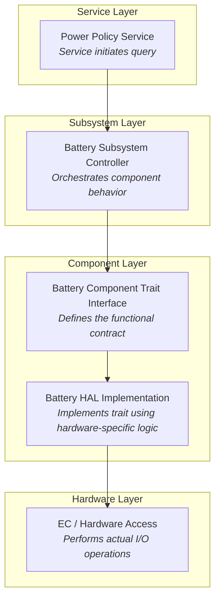

# Battery Service Registry

So far, we've defined our mock battery and wrapped it in Device wrapper so that it is ready to be included in a Service registry.

To do so meant committing to an embedded target build and a no-std environment compatible with the ODP crates and dependencies.

Now it is time to prepare the code we need to put this MockBatteryDevice to work.


### Looking at the examples
The `embedded-services` repository has some examples for us to consider already.  In the `embedded-services/examples/std` folder, particularly in `battery.rs` and `power_policy.rs` we can see how devices are created and then registered, and also how they are executed via per-device tasks.  The system is initialized and a runtime `Executor` is used to spawn the tasks.

There are a few tricks involved, though, because Embassy is normally designed to run in an embedded context, and we are using it in a std local machine environment.  That's fine.  In the end, we will build in such a way that we can define, build, and test our component completely before committing to an embedded target, and when we do there will only be minor changes required.


## 🔌 Wiring Up the Battery Service
We need to create a device `Registry` as defined by `embedded-services` to wire our `MockBatteryDevice` into.

To do this, let's replace our current `mock_battery/main.rs` with this:

```rust
use embassy_executor::Executor;
use static_cell::StaticCell;

use embedded_services::init;
use embedded_services::power::policy::{register_device, DeviceId};
use mock_battery::mock_battery_device::MockBatteryDevice;

static EXECUTOR: StaticCell<Executor> = StaticCell::new();
static BATTERY: StaticCell<MockBatteryDevice> = StaticCell::new();

fn main() {
    let executor = EXECUTOR.init(Executor::new());

    // Construct battery and extract needed values *before* locking any 'static borrows
    let battery = BATTERY.init(MockBatteryDevice::new(DeviceId(1)));

    executor.run(|spawner| {
        spawner.spawn(init_task(battery)).unwrap();
        spawner.spawn(battery_service::task()).unwrap();
    });
}


#[embassy_executor::task]
async fn init_task(battery:&'static mut MockBatteryDevice) {
    println!("🔋 Launching battery service (single-threaded)");

    init().await;

    println!("🧩 Registering battery device...");
    register_device(battery).await.unwrap();

    println!("✅🔋 Battery service is up and running.");
}

```

You should type `cargo run` and after it builds you should see this output:

```
     Running `target\debug\mock_battery.exe`
🔋 Launching battery service (single-threaded)
🧩 Registering battery device...
✅🔋 Battery service is up and running.
```

## Our main code
Our new main code does a few new important things.

1. It uses the static allocator and `StaticCell` to create single ownership of our component structures.
2. It initializes these `StaticCell` instances in `main`
3. It passes them into asynchronous tasks that execute upon them.

This pattern comes from the use of Embassy Executor and we will use it throughout the evolution of this example.

## The Battery Service
Now we have registered our battery device as a device for the embedded-services power policy,
but the `battery_service` also knows how to use a battery specifically to read the charge available, so we need to register our battery as a 'fuel gauge' by that definition.

### The fuel gauge
The battery service has the concept of a 'fuel gauge' that calls into the SmartBattery traits to monitor charge / discharge. 

We'll hook that up now.

Add this `use` statement near the top of your `main.rs` file:
```rust
use battery_service::device::{Device as BatteryDevice, DeviceId as BatteryDeviceId};
```

Then add this static declaration for our fuel gauge device service. Place it near the other statics for `EXECUTOR`, and `BATTERY`. 

```rust
static BATTERY_FUEL: StaticCell<BatteryDevice> = StaticCell::new();
```

add this task at the end of the file:
```rust
#[embassy_executor::task]
async fn battery_service_init_task(
    dev: &'static mut BatteryDevice
) {
    println!("🔌 Initializing battery fuel gauge service...");
    battery_service::register_fuel_gauge(dev).await.unwrap();
}
```
and we'll call it by placing this at the end of the `run` block in `main()`, below the other two task spawns, after
getting the id from the battery and initializeing the fuel gauge.  So the new `main()` should look like:

```rust
fn main() {
    let executor = EXECUTOR.init(Executor::new());

    // Initialize our values one time
    let battery = BATTERY.init(MockBatteryDevice::new(DeviceId(1)));
    let battery_id = battery.device().id().0;
    let fuel = BATTERY_FUEL.init(BatteryDevice::new(BatteryDeviceId(battery_id)));

    executor.run(|spawner| {
        spawner.spawn(init_task(battery)).unwrap();
        spawner.spawn(battery_service::task()).unwrap();
        spawner.spawn(battery_service_init_task(fuel)).unwrap();

    });
}
```

Verify you can still build cleanly.  When you execute `cargo run` now, you should see output verifying our tasks have been run,
including our new fuel gauge service initialization task, with the line "🔌 Initializing battery fuel gauge service..."
```
     Running `target\debug\mock_battery.exe`
🔌 Initializing battery fuel gauge service...
🔋 Launching battery service (single-threaded)
🧩 Registering battery device...
✅🔋 Battery service is up and running.

```

>#### Why spawn all these individual tasks?
> This pattern may seem odd.  You may wonder "why run these as tasks instead of just calling them from main?"
> One reason is that these functions are asynchronous and must be called from an asynchronous context, so we need to 
> use the `Spawner` of the Embassy `Executor` to do that.
> The other is that each of these tasks form a self-contained mini-service that runs autonomously and may respond to signals
> to affect its behavior. 
> In `main` we are effectively launching a pre-configured set of cooperatively interacting agents with this pattern.

### Implementing "comms"

The battery service is one of several services that may reside within the Embedded Controller (EC) microcontroller. In a fully integrated system, messages between the EC and other components — such as a host CPU or companion chips — are typically carried over physical transports like SPI or I²C.

However, within the EC firmware itself, services communicate through an internal message routing layer known as `comms`. This abstraction allows us to test and exercise service logic without needing external hardware.

At this point, we’ll establish a simple `comms` setup that allows messages to reach our battery service from other parts of the EC — particularly the power policy manager. The overall `comms` architecture can expand later to handle actual buses, security paging, or multi-core domains, but for now, a minimal local implementation will suffice.

#### The "espi" comms
We'll follow a pattern exhibited by the ODP `embedded-services/examples/std/src/bin/battery.rs`, but trimmed for our uses.

Create a file for a module named `espi_service.rs` inside your `mock_battery/src` folder and give it this content:

```rust
use battery_service::context::{BatteryEvent, BatteryEventInner};
use battery_service::device::DeviceId;
use embassy_sync::blocking_mutex::raw::ThreadModeRawMutex;
use embassy_sync::signal::Signal;
use embedded_services::comms::{self, EndpointID, Internal, MailboxDelegate, MailboxDelegateError, Message};
use embedded_services::ec_type::message::BatteryMessage;


use core::sync::atomic::{AtomicBool, Ordering};
use static_cell::StaticCell;

pub struct EspiService {
    pub endpoint: comms::Endpoint,
    _signal: Signal<NoopRawMutex, BatteryMessage>,
}

impl EspiService {
    pub fn new() -> Self {
        Self {
            endpoint: comms::Endpoint::uninit(EndpointID::Internal(Internal::Battery)),
            _signal: Signal::new(),
        }
    }
}

impl MailboxDelegate for EspiService {
    fn receive(&self, _message: &Message) -> Result<(), MailboxDelegateError> {
        Ok(())
    }
}

// Actual static values
static INSTANCE: StaticCell<EspiService> = StaticCell::new();
// Create a cached global reference
static mut INSTANCE_REF: Option<&'static EspiService> = None;
static INSTANCE_READY: AtomicBool = AtomicBool::new(false);


pub async fn init() {
    println!("🔌 EspiService init()");
    let svc = INSTANCE.init(EspiService::new());
    // 🆕 Store the reference
    unsafe {
        INSTANCE_REF = Some(svc);
    }

    println!("🧩 Registering ESPI service endpoint...");
    if comms::register_endpoint(svc, &svc.endpoint).await.is_err() {
        panic!("Failed to register ESPI service endpoint");
    }

    INSTANCE_READY.store(true, Ordering::Relaxed);
    println!("✅🔌 EspiService READY");
}

pub fn get() -> &'static EspiService {
    if !INSTANCE_READY.load(Ordering::Relaxed) {
        panic!("ESPI_SERVICE not initialized yet");
    }

    unsafe {
        INSTANCE_REF.expect("ESPI_SERVICE reference not set")
    }
}

#[embassy_executor::task]
pub async fn task() {
    use embassy_time::{Duration, Timer};

    let svc = get();

    let _ = svc
        .endpoint
        .send(
            EndpointID::Internal(comms::Internal::Battery),
            &BatteryEvent {
                device_id: DeviceId(1),
                event: BatteryEventInner::DoInit,
            },
        )
        .await;

    let _ = battery_service::wait_for_battery_response().await;

    loop {
        let _ = svc
            .endpoint
            .send(
                EndpointID::Internal(comms::Internal::Battery),
                &BatteryEvent {
                    device_id: DeviceId(1),
                    event: BatteryEventInner::PollDynamicData,
                },
            )
            .await;

        let _ = battery_service::wait_for_battery_response().await;
        Timer::after(Duration::from_secs(5)).await;
    }
}
```
Here we've implemented a "comms" `MailboxDelegate` `receive` function to Receive `Message` communications, although it is currently not doing anything with them.

We also have defined the task functions that are called to init and listen.

Remember to add this module to your `lib.rs` file:

```rust
pub mod mock_battery;
pub mod virtual_battery;
pub mod mock_battery_device;
pub mod espi_service;
```

Verify we have our reference to `embassy-time` as shown here, as well as `embassy-sync` in the `[dependencies]` section of our `mock_battery/Cargo.toml` file:
```toml
embassy-time = { workspace = true, features=["std"] }
embassy-sync = { workspace = true }
```


#### Time Driver
Embassy requires a time driver for its timer functions.  We can create a simple one for use in our std environment.
Create a file named `time_driver.rs` in your `mock_battery` project with these contents:

```rust
use embassy_time::Ticker;

#[embassy_executor::task]
pub async fn run() {
    println!("🕒 time_driver started");

    let mut ticker = Ticker::every(embassy_time::Duration::from_millis(1));
    loop {
        ticker.next().await;
    }
}
```

and add this near top of `main.rs`:

```rust
mod time_driver;
use mock_battery::espi_service;
```

We need to add these tasks to `main.rs` to go with the other tasks we have created:
```rust

#[embassy_executor::task]
async fn espi_service_init_task() {
    espi_service::init().await;
}

#[embassy_executor::task]
async fn test_message_sender() {
    use battery_service::context::{BatteryEvent, BatteryEventInner};
    use battery_service::device::DeviceId;
    use embedded_services::comms::EndpointID;

    println!("✍ Sending test BatteryEvent...");

    // Wait a moment to ensure other services are initialized 
    embassy_time::Timer::after(embassy_time::Duration::from_millis(100)).await;

    // Access the ESPI_SERVICE singleton
    let svc = mock_battery::espi_service::get();

    let event = BatteryEvent {
        device_id: DeviceId(1),
        event: BatteryEventInner::PollStaticData, // or DoInit, PollDynamicData, etc.
    };

    if let Err(e) = svc.endpoint.send(
        EndpointID::Internal(embedded_services::comms::Internal::Battery),
        &event,
    ).await {
        println!("❌ Failed to send test BatteryEvent: {:?}", e);
    } else {
        println!("✅ Test BatteryEvent sent");
    }
}
```
These tasks:
- initializes our `espi_service` comms support.
- defines a function for sending a test message to the battery

Now, we need to update the `run` block in our `main()` function to include these three tasks to what already exists in the spawn list:


```rust
        spawner.spawn(time_driver::run()). unwrap();
        spawner.spawn(espi_service_init_task ()).unwrap();
        spawner.spawn(test_message_sender()).unwrap();

```

After all this is in place if we run it, we should see this output:

```
     Running `target\debug\mock_battery.exe`
✍ Sending test BatteryEvent...
🔋 Initializing battery fuel gauge service...
🔌 EspiService init()
🔌 Registering ESPI service endpoint...
🔋 Launching battery service (single-threaded)
🧩 Registering battery device...
✅ Battery service is up and running.
🕒 time_driver started
🔌 EspiService READY
✅ Test BatteryEvent sent

```

Which shows our spawned tasks going through their steps and the test message having been sent.

But we have nothing in place to respond to this message yet.

### The `Controller`

You may recall from earlier diagrams that the bridge between the embedded-services service (e.g. `power-policy` service) and the subsystems that it communicates with (e.g. `battery` subsystem) is through a `Controller`.


But as we have it constructed up to this point, we have not  yet established a `Controller` into the scheme.  We are sending our `test message`
directly to our espi_service which currently doesn't do anything with it.  

We'll change things so that our espi service will delegate control to a `Controller`, consistent with how the service works in a real system, before we extend the behaviors of our mock battery.  This will make things more consistent with our eventual target.

#### The Battery Controller
The battery service `Controller` is the trait interface used to control a battery connected via the `SmartBattery` trait interface at a slightly higher level.  

Create a new file in your `mock_battery` project named `mock_battery_controller.rs` and give it this content:

```rust
use battery_service::controller::{Controller, ControllerEvent};
use battery_service::device::{DynamicBatteryMsgs, StaticBatteryMsgs};
use embassy_time::{Duration, Timer};
use embedded_batteries_async::smart_battery::{
    SmartBattery, ErrorType, 
    ManufactureDate, SpecificationInfoFields, CapacityModeValue, CapacityModeSignedValue,
    BatteryModeFields, BatteryStatusFields,
    DeciKelvin, MilliVolts
};

pub struct MockBatteryController<B: SmartBattery + Send> {
    /// The underlying battery instance that this controller manages.
    battery: B,
}

impl<B> MockBatteryController<B>
where
    B: SmartBattery + Send,
{
    pub fn new(battery: B) -> Self {
        Self { battery }
    }
}

impl<B> ErrorType for MockBatteryController<B>
where
    B: SmartBattery + Send,
{
    type Error = B::Error;
}
impl<B> SmartBattery for &mut MockBatteryController<B>
where
    B: SmartBattery + Send,
{
    async fn temperature(&mut self) -> Result<DeciKelvin, Self::Error> {
        self.battery.temperature().await
    }

    async fn voltage(&mut self) -> Result<MilliVolts, Self::Error> {
        self.battery.voltage().await
    }

    async fn remaining_capacity_alarm(&mut self) -> Result<CapacityModeValue, Self::Error> {
        self.battery.remaining_capacity_alarm().await
    }

    async fn set_remaining_capacity_alarm(&mut self, _: CapacityModeValue) -> Result<(), Self::Error> {
        self.battery.set_remaining_capacity_alarm(CapacityModeValue::MilliAmpUnsigned(0)).await
    }

    async fn remaining_time_alarm(&mut self) -> Result<u16, Self::Error> {
        self.battery.remaining_time_alarm().await
    }

    async fn set_remaining_time_alarm(&mut self, _: u16) -> Result<(), Self::Error> {
        self.battery.set_remaining_time_alarm(0).await
    }

    async fn battery_mode(&mut self) -> Result<BatteryModeFields, Self::Error> {
        self.battery.battery_mode().await
    }

    async fn set_battery_mode(&mut self, _: BatteryModeFields) -> Result<(), Self::Error> {
        self.battery.set_battery_mode(BatteryModeFields::default()).await
    }

    async fn at_rate(&mut self) -> Result<CapacityModeSignedValue, Self::Error> {
        self.battery.at_rate().await
    }

    async fn set_at_rate(&mut self, _: CapacityModeSignedValue) -> Result<(), Self::Error> {
        self.battery.set_at_rate(CapacityModeSignedValue::MilliAmpSigned(0)).await
    }

    async fn at_rate_time_to_full(&mut self) -> Result<u16, Self::Error> {
        self.battery.at_rate_time_to_full().await
    }

    async fn at_rate_time_to_empty(&mut self) -> Result<u16, Self::Error> {
        self.battery.at_rate_time_to_empty().await
    }

    async fn at_rate_ok(&mut self) -> Result<bool, Self::Error> {
        self.battery.at_rate_ok().await
    }

    async fn current(&mut self) -> Result<i16, Self::Error> {
        self.battery.current().await
    }

    async fn average_current(&mut self) -> Result<i16, Self::Error> {
        self.battery.average_current().await
    }

    async fn max_error(&mut self) -> Result<u8, Self::Error> {
        self.battery.max_error().await
    }

    async fn relative_state_of_charge(&mut self) -> Result<u8, Self::Error> {
        self.battery.relative_state_of_charge().await
    }

    async fn absolute_state_of_charge(&mut self) -> Result<u8, Self::Error> {
        self.battery.absolute_state_of_charge().await
    }

    async fn remaining_capacity(&mut self) -> Result<CapacityModeValue, Self::Error> {
        self.battery.remaining_capacity().await
    }

    async fn full_charge_capacity(&mut self) -> Result<CapacityModeValue, Self::Error> {
        self.battery.full_charge_capacity().await
    }

    async fn run_time_to_empty(&mut self) -> Result<u16, Self::Error> {
        self.battery.run_time_to_empty().await
    }

    async fn average_time_to_empty(&mut self) -> Result<u16, Self::Error> {
        self.battery.average_time_to_empty().await
    }

    async fn average_time_to_full(&mut self) -> Result<u16, Self::Error> {
        self.battery.average_time_to_full().await
    }

    async fn charging_current(&mut self) -> Result<u16, Self::Error> {
        self.battery.charging_current().await
    }

    async fn charging_voltage(&mut self) -> Result<u16, Self::Error> {
        self.battery.charging_voltage().await
    }

    async fn battery_status(&mut self) -> Result<BatteryStatusFields, Self::Error> {
        self.battery.battery_status().await
    }

    async fn cycle_count(&mut self) -> Result<u16, Self::Error> {
        self.battery.cycle_count().await
    }

    async fn design_capacity(&mut self) -> Result<CapacityModeValue, Self::Error> {
        self.battery.design_capacity().await
    }

    async fn design_voltage(&mut self) -> Result<u16, Self::Error> {
        self.battery.design_voltage().await
    }

    async fn specification_info(&mut self) -> Result<SpecificationInfoFields, Self::Error> {
        self.battery.specification_info().await
    }

    async fn manufacture_date(&mut self) -> Result<ManufactureDate, Self::Error> {
        self.battery.manufacture_date().await
    }   

    async fn serial_number(&mut self) -> Result<u16, Self::Error> {
        self.battery.serial_number().await
    }

    async fn manufacturer_name(&mut self, _: &mut [u8]) -> Result<(), Self::Error> {
        self.battery.manufacturer_name(&mut []).await
    }

    async fn device_name(&mut self, _: &mut [u8]) -> Result<(), Self::Error> {
        self.battery.device_name(&mut []).await
    }

    async fn device_chemistry(&mut self, _: &mut [u8]) -> Result<(), Self::Error> {
        self.battery.device_chemistry(&mut []).await
    }    
}

impl<B> Controller for &mut MockBatteryController<B>
where
    B: SmartBattery + Send,
{
    type ControllerError = B::Error;

    async fn initialize(&mut self) -> Result<(), Self::ControllerError> {
        Ok(())
    }

    async fn get_static_data(&mut self) -> Result<StaticBatteryMsgs, Self::ControllerError> {
        Ok(StaticBatteryMsgs { ..Default::default() })
    }

    async fn get_dynamic_data(&mut self) -> Result<DynamicBatteryMsgs, Self::ControllerError> {
        Ok(DynamicBatteryMsgs { ..Default::default() })
    }

    async fn get_device_event(&mut self) -> ControllerEvent {
        loop {
            Timer::after(Duration::from_secs(60)).await;
        }
    }

    async fn ping(&mut self) -> Result<(), Self::ControllerError> {
        Ok(())
    }

    fn get_timeout(&self) -> Duration {
        Duration::from_secs(10)
    }

    fn set_timeout(&mut self, _duration: Duration) {
        // Ignored for mock
    }
}
```
This simply creates a `Controller` for the `battery_service` that implements the `SmartBattery` Traits as a pass-through to the our MockBattery implementation.  It also implements -- as stubs for now -- those traits of the `Controller` itself.

The `Controller` is typically wrapped using a `Wrapper` struct provided by `battery_service`. The `Wrapper` is responsible for listening for incoming messages from the service and dispatching them to the appropriate method on the controller (e.g., `get_dynamic_data()`, `ping()`).

We'll be implementing such a wrapper shortly.

#### add to `lib.rs`
Don't forget that we need to include this new file in our `lib.rs` declarations:

```rust
pub mod mock_battery;
pub mod virtual_battery;
pub mod mock_battery_device;
pub mod espi_service;
pub mod mock_battery_controller;

```

Make sure you can build cleanly at this point, and then we will move ahead.

### Adding the Wrapper

Let's implement the controller into our `main.rs`.  Start by adding these imports toward the top of that file:

```rust
use embassy_executor::Spawner; 
use battery_service::wrapper::Wrapper;
use mock_battery::mock_battery_controller::MockBatteryController;
use mock_battery::mock_battery::MockBattery;
use embassy_sync::blocking_mutex::raw::ThreadModeRawMutex;
use embassy_sync::signal::Signal;
```

We'll create new `StaticCell` instances for our `Controller` and `Wrapper`.  Add these near your other static declarations:

```rust
static BATTERY_WRAPPER: StaticCell<
        Wrapper<'static, &'static mut MockBatteryController<&'static mut MockBattery>>
    > = StaticCell::new();
static CONTROLLER: StaticCell<MockBatteryController<&'static mut MockBattery>> = StaticCell::new();
```
add this task to run the wrapper at the bottom of the file along with the other tasks:

```rust
#[embassy_executor::task]
async fn wrapper_task(wrapper: &'static mut Wrapper<'static, &'static mut MockBatteryController<&'static mut MockBattery>>) {
    wrapper.process().await;
}
```

#### Adding signaling for service readiness
Up to now we've been able to simply spawn our tasks asynchronously in parallel because there hasn't been much interdependence between them.
But before we can connect our new `Controller`, we need to make sure the services it relies on are all ready to go.

In particular, we need to know when the `battery_service_init_task()` that registers the battery fuel gauge service is complete.  To facilitate that, we'll create a Signal and a couple of static references we can use when we create the registration.  We've already include the import statements we will need for this.

Add this just below your current `static` declarations:

```rust
pub struct BatteryFuelReadySignal {
    signal: Signal<NoopRawMutex, ()>,
}

impl BatteryFuelReadySignal {
    pub fn new() -> Self {
        Self {
            signal: Signal::new(),
        }
    }

    pub fn signal(&self) {
        self.signal.signal(());
    }

    pub async fn wait(&self) {
        self.signal.wait().await;
    }
}
static BATTERY_FUEL_READY: StaticCell<BatteryFuelReadySignal> = StaticCell::new();
```

and update your `battery_service_init_task()` to now look like this, so that we pass in our signal value the task will use to  notify when it is ready:

```rust
#[embassy_executor::task]
async fn battery_service_init_task(
    dev: &'static mut BatteryDevice,
    ready: &'static BatteryFuelReadySignal // passed in signal
) {
    println!("🔌 Initializing battery fuel gauge service...");
    battery_service::register_fuel_gauge(dev).await.unwrap();
    
    // signal that the battery fuel service is ready
    ready.signal(); 
}
```

Now, to tie this together, we need another task that launches our Controller wrapper when it is ready. Add this to the end of `main.rs` with the other tasks:

```rust
#[embassy_executor::task]
async fn wrapper_task_launcher(
    fuel: &'static BatteryDevice,
    controller: &'static mut MockBatteryController<&'static mut MockBattery>,
    ready: &'static BatteryFuelReadySignal,
    spawner: Spawner,
) {
    println!("🔄 Launching wrapper task...");

    ready.wait().await;
    println!("🔔 BATTERY_FUEL_READY signaled");

    let wrapper = BATTERY_WRAPPER.init(Wrapper::new(fuel, controller));
    spawner.spawn(wrapper_task(wrapper)).unwrap();
    spawner.spawn(test_message_sender()).unwrap();
}

```
You'll note this one is a bit different than the others.  We pass in a Spawner, and in turn use it to spawn our wrapper when we get the signal that our battery fuel gauge service is ready, and _then_ send our test message.


In your `run` block of `main()`, remove the old call to send the test message:

```rust
    spawner.spawn(test_message_sender()).unwrap();
```
and replace it with the call to our wrapper task launcher with this:

```rust
    spawner.spawn(wrapper_task_launcher(fuel, controller, battery_fuel_ready, spawner)).unwrap();
```
Where we pass in what this new async launcher will need.

We also need to update the call to `battery_service_init_task` to pass in the `ready` signal, in main where we
create the other static initializations:
```rust
    let battery_fuel_ready = BATTERY_FUEL_READY.init(BatteryFuelReadySignal::new());
```
and we also have to init our `Controller`.  The `MockBatteryController` needs the battery from the MockBatteryDevice.
```rust
    let inner_battery = battery.inner_battery();
    let controller = CONTROLLER.init(MockBatteryController::new(inner_battery));
```

so we can update our `executor.run()` block so it has the following spawns:
```rust
    executor.run(|spawner| {
        spawner.spawn(init_task(battery)).unwrap();
        spawner.spawn(battery_service::task()).unwrap();
        spawner.spawn(battery_service_init_task(fuel, battery_fuel_ready)).unwrap(); 
        spawner.spawn(time_driver::run()). unwrap(); 
        spawner.spawn(espi_service_init_task ()).unwrap(); 
        spawner.spawn(wrapper_task_launcher(fuel, controller, battery_fuel_ready, spawner)).unwrap(); 

```

And herein lies a problem. If we build this code, we'll receive an error:

> cannot borrow `*fuel` as immutable because it is also borrowed as mutable

this is a "double-borrow" violation of Rust. We've already 'borrowed' `fuel` by passing it to `battery_service_init_task`, so attempting to use it again creates the violation  because Rust can't be certain these two shares won't conflict with one another.

We can get around this with a bit of `unsafe` marked code that creates a copy we can borrow instead.
```rust
let fuel_for_controller = unsafe { &mut *(fuel as *const _ as *mut _) };
```
and we'll use this reference to pass to the wrapper_task_launcher, since `fuel` has already been referenced by `battery_service_init_task`.

We will soon learn that this same situation applies to the access to `battery` as well, but it actually has three separate cases: one to get the `battery_id`, one to get the `inner_battery`, and one to pass to the `init_task`.

So our new main now looks like this:

```
fn main() {
    let executor = EXECUTOR.init(Executor::new());

    // Construct battery and extract needed values *before* locking any 'static borrows
    let battery = BATTERY.init(MockBatteryDevice::new(DeviceId(1)));
    let battery_for_id: &'static mut MockBatteryDevice = unsafe { &mut *(battery as *const _ as *mut _) };
    let battery_for_inner: &'static mut MockBatteryDevice = unsafe { &mut *(battery as *const _ as *mut _) };
    let battery_id = battery_for_id.device().id().0;
    let fuel = BATTERY_FUEL.init(BatteryDevice::new(BatteryDeviceId(battery_id)));
    let battery_fuel_ready = BATTERY_FUEL_READY.init(BatteryFuelReadySignal::new());
    let inner_battery = battery_for_inner.inner_battery();
    let fuel_for_controller = unsafe { &mut *(fuel as *const _ as *mut _) };
    let controller = CONTROLLER.init(MockBatteryController::new(inner_battery));

    executor.run(|spawner| {
        spawner.spawn(init_task(battery)).unwrap();
        spawner.spawn(battery_service::task()).unwrap();
        spawner.spawn(battery_service_init_task(fuel, battery_fuel_ready)).unwrap();
        spawner.spawn(time_driver::run()). unwrap();
        spawner.spawn(espi_service_init_task ()).unwrap();
        spawner.spawn(wrapper_task_launcher(fuel_for_controller, controller, battery_fuel_ready, spawner)).unwrap();
    });
}
```


The output of `cargo run` should now be:

```
     Running `target\debug\mock_battery.exe`
🔄 Launching wrapper task...
🔌 EspiService init()
🧩 Registering ESPI service endpoint...
🕒 time_driver started
🔌 Initializing battery fuel gauge service...
🔋 Launching battery service (single-threaded)
🧩 Registering battery device...
✅🔋 Battery service is up and running.
✅🔌 EspiService READY
🔔 BATTERY_FUEL_READY signaled
✍ Sending test BatteryEvent...
✅ Test BatteryEvent sent
```

So we can see that the services fire up and once the ready signal is seen, we send our test message.
This establishes the basic skeletal flow we need to complete our service wirings and tests.

With our components registered, we are now ready to begin testing real message flows and simulate battery behaviors under event-driven conditions.


