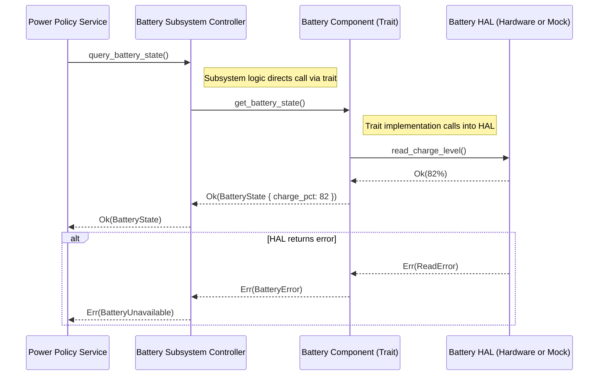

## Revisiting Messages
We now have the component parts of our battery subsystem assembled and it is ready to accept messages as it would in a true integration.

However, we are no longer calling our `test_message_sender` task, so we are not communicating with our battery.
We could add that at the end of `wrapper_task_launcher` so that it is called once the wrapper is in place.  
Like before, though, the test message isn't acted upon by the espi_service BatteryMessage handling, so all we would see our output is:

```
🔄 Launching wrapper task...
🔌 EspiService init()
🧩 Registering ESPI service endpoint...
🕒 time_driver started
🔌 Initializing battery fuel gauge service...
🔋 Launching battery service (single-threaded)
🧩 Registering battery device...
✅🔋 Battery service is up and running.
✅🔌 EspiService READY
🔔 BATTERY_FUEL_READY signaled
🚀 Spawning wrapper_task...
✍ Sending test BatteryEvent...
✅ Test BatteryEvent sent
```

### Completing the wiring

If we review our messaging diagram, we are reminded that the Controller is what manages the interface for the subsystem, and it may do so by interrogating its constituent components.



Now, we _could_ make a virtual battery by implementing the desired behaviors directly on the `Controller`, but that would be disingenuous
to the component structure we have been working toward - one that has replaceable modular component sections at the component level and at the HAL layer.

We've already implemented `MockBatteryController` to call down into its contained MockBattery instance.

Now we can start wiring up the actual `BatteryEvent` actions.

Our `test_message_sender` is sending a `BatteryEvent` message (`PollStaticData`), but this goes unanswered in our current `espi_service` `MailboxDelegate` implementation.


####  Revising the EspiService to forward to a channel

You may recall our EspiService construction in `espi_service.rs` and its `MailboxDelegate` implementation.
We will want to expand this so that it can respond to messages it receives and calls upon the Battery Controller to act upon those messages.

But our current `EspiService` is not up to this task for a couple of reasons.

The first is that we have not given it a controller reference to talk to, and the second reason is that
the controller methods are async, but the `EspiService` `MailboxDelegate` `receive` function is a synchronous context.

What we want to do instead here is to have `EspiService` simply forward these messages to an asynchronous message queue, or `Channel`, that we can poll as one of our spawned async tasks in our main code.

_TODO_: Changes to EspiService and adding the event handler task

