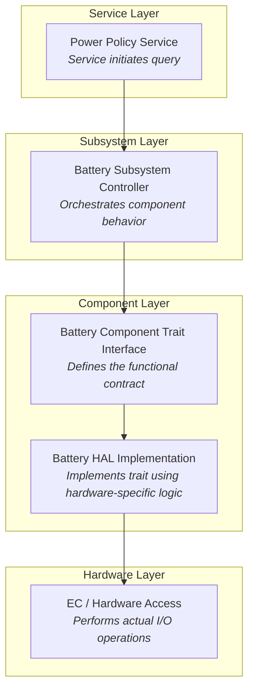
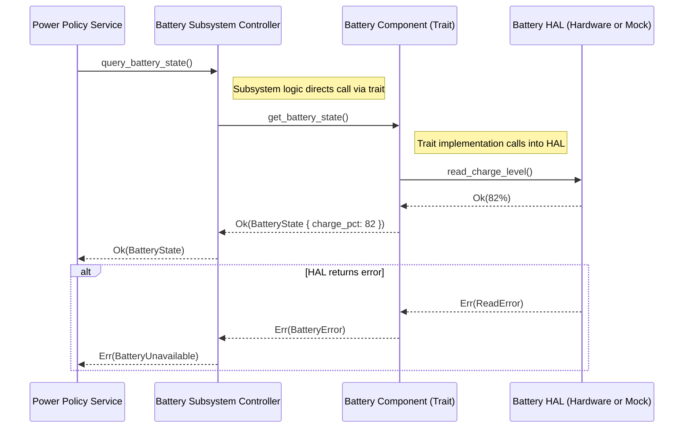

# Battery component Diagrams

The construction of a component such as our battery looks as follows.

```mermaid
flowchart TD
    A[Power Policy Service<br><i>Service initiates query</i>]
    B[Battery Subsystem Controller<br><i>Orchestrates component behavior</i>]
    C[Battery Component Trait Interface<br><i>Defines the functional contract</i>]
    D[Battery HAL Implementation<br><i>Implements trait using hardware-specific logic</i>]
    E[EC / Hardware Access<br><i>Performs actual I/O operations</i>]

    A --> B
    B --> C
    C --> D
    D --> E

    subgraph Service Layer
        A
    end

    subgraph Subsystem Layer
        B
    end

    subgraph Component Layer
        C
        D
    end

    subgraph Hardware Layer
        E
    end
```

When in operation, it conducts its operations in response to message events

```mermaid
sequenceDiagram
    participant Service as Power Policy Service
    participant Controller as Battery Subsystem Controller
    participant Component as Battery Component (Trait)
    participant HAL as Battery HAL (Hardware or Mock)

    Service->>Controller: query_battery_state()
    Note right of Controller: Subsystem logic directs call via trait
    Controller->>Component: get_battery_state()
    Note right of Component: Trait implementation calls into HAL
    Component->>HAL: read_charge_level()
    HAL-->>Component: Ok(82%)
    Component-->>Controller: Ok(BatteryState { charge_pct: 82 })
    Controller-->>Service: Ok(BatteryState)

    alt HAL returns error
        HAL-->>Component: Err(ReadError)
        Component-->>Controller: Err(BatteryError)
        Controller-->>Service: Err(BatteryUnavailable)
    end

```