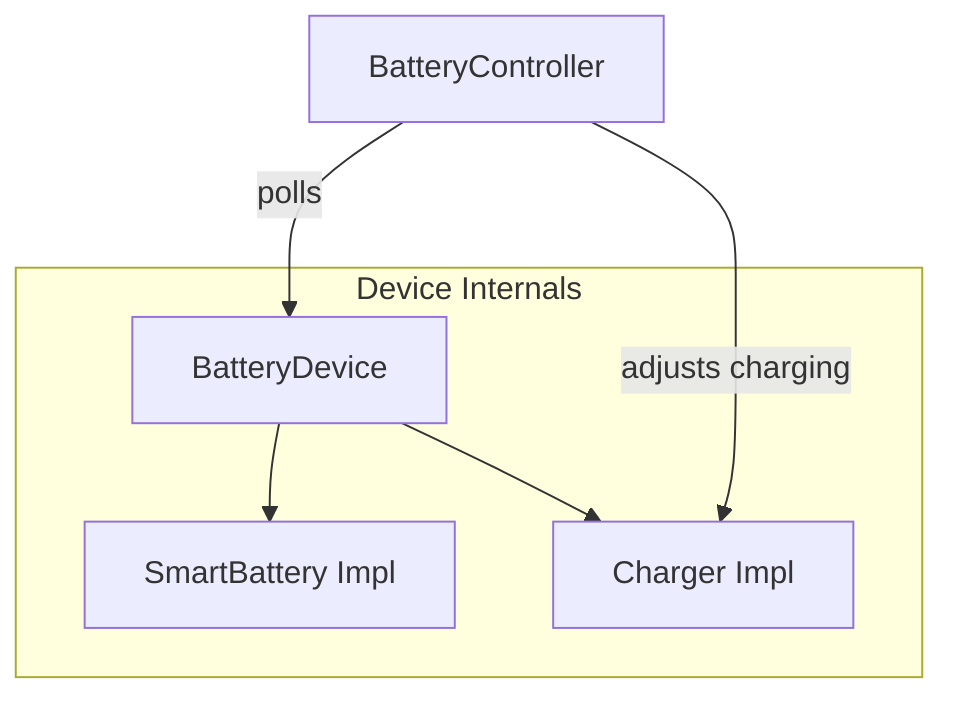
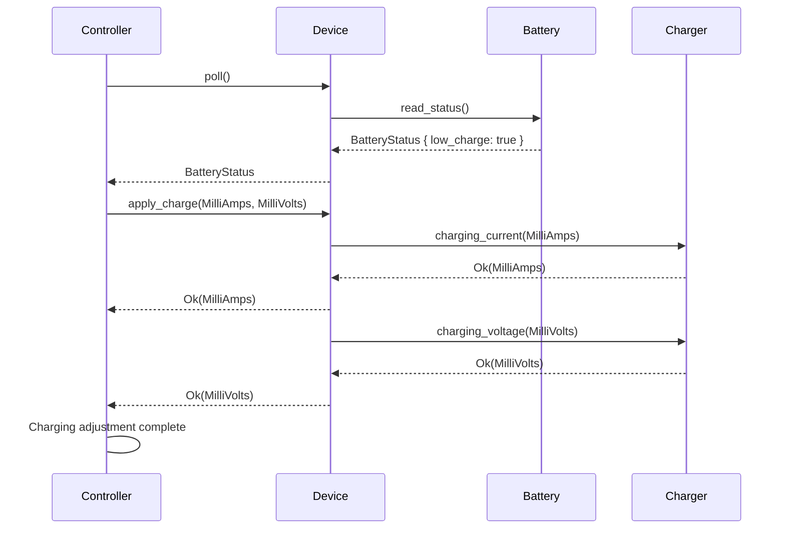

# Charger

The charger is not an independent runtime component itself. It is a tightly couple extension of the battery and answers to the `BatteryController` via `SmartBattery` interface.  The `Controller` determines charging behaviors of its `BatteryDevice` via the `SmartBattery` traits of its inner battery component, and then calls upon its inner charger component to adjust the charging profile.  

The `BatteryDevice` contains both the `SmartBattery` implementation (as battery) and the `Charger` implementation (as charger).
The `BatteryDevice` is registered with the `BatteryController`, which polls the battery, interprets the data, and invokes charger methods to respond to battery needs.

Here, the controller polls the battery state, and the battery indicates that is has a low charge.  The controller determines the charging parameters and instructs the charger.  The battery charge level should now improve as the charge is applied over time.

