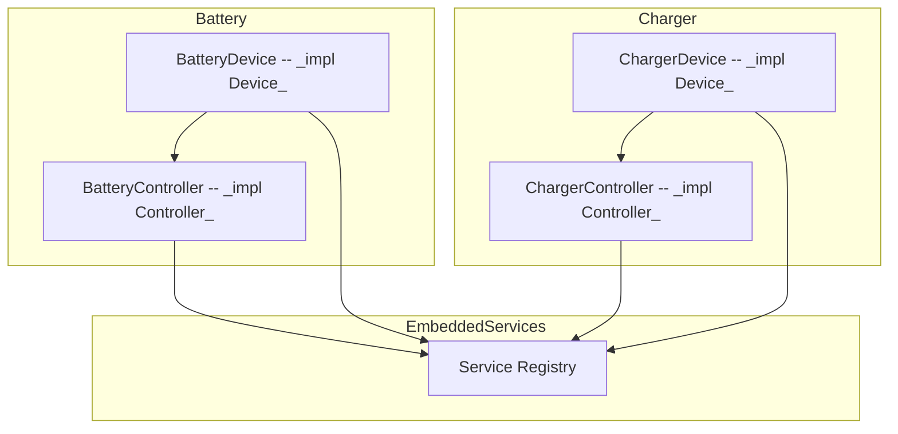
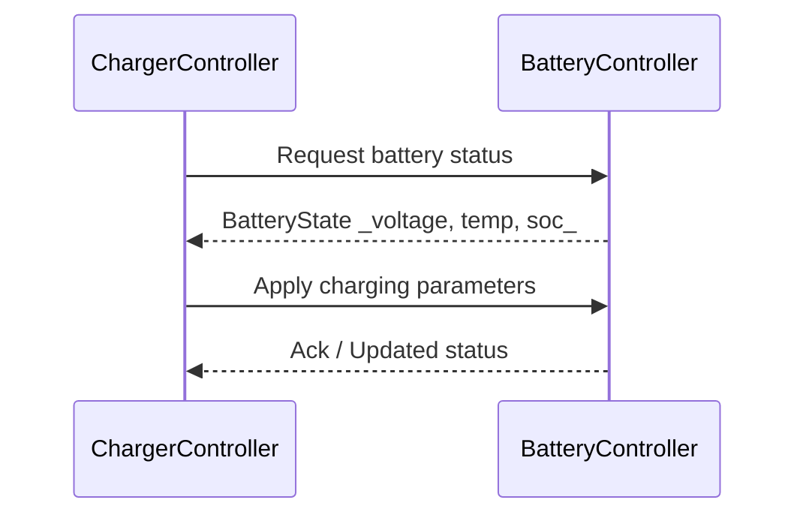
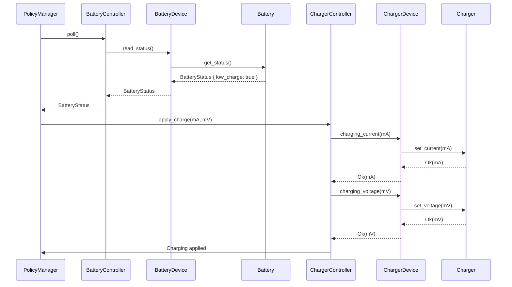

# Charger
The Charger component is by nature closely associated with the battery, and could be tightly coupled as an extension to that subsystem and sharing the battery Controller. However, that would undermine the modular component advantages of ODP because the charger is an independent component and could be matched with different battery configurations.

__Battery__ and __Charger__ are two independent components, each with their own `Device`, `Controller`, and `Service`.  They are registered individually with the embedded-services framework and communicate only via messaging through our `comms` implementation.
This models real-world physical separation, where a charging circuit and a battery pack are distinct units that coordinate via well-defined interfaces.

The `BatteryDevice` contains both the `SmartBattery` implementation (as battery) and the `Charger` implementation (as charger).
The `BatteryDevice` is registered with the `BatteryController`, which polls the battery, interprets the data, and invokes charger methods to respond to battery needs.

When paired with the battery, the two work in concert:

Here, the controller polls the battery state, and the battery indicates that is has a low charge.  The controller determines the charging parameters and instructs the charger.  The battery charge level should now improve as the charge is applied over time.

