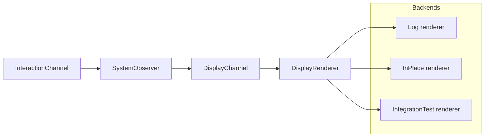

# Display Rendering

Earlier on, we introduced the `SystemObserver` structure, which is responsible for observing and reporting on the state of the system.  One of its key features is the ability to render a display output, which we can implement in various ways, from a simple console output to a more complex graphical interface or a test reporting system.

The mechanism we will use for this will be embodied in a structure we will call `DisplayRenderer`.  This structure will be responsible for taking the data from the `SystemObserver` and rendering it in a way that is useful for our purposes.

## DisplayRenderer
Because we will have more than one implementation of `DisplayRenderer`, we will define a trait that all implementations must satisfy.  This trait will define the methods that must be implemented by any structure that wishes to be a `DisplayRenderer`.

create a new folder in the `src` directory called `display_render`, and within that folder create a new file called `mod.rs`.  In `mod.rs`, add the following:

```rust
// display_render
pub mod display_render;
pub mod log_render;
pub mod in_place_render;
``` 
Then, in this display_render folder, create empty files for `display_render.rs`, `log_render.rs`, and `in_place_render.rs`.

In `display_render.rs`, we will define the `DisplayRenderer` trait and some helper methods that address common rendering tasks and display mode switching.

```rust
use crate::events::RenderMode;
use crate::display_models::{DisplayValues, InteractionValues, StaticValues};
use crate::display_render::in_place_render::InPlaceBackend;
use crate::display_render::log_render::LogBackend;
use crate::events::DisplayEvent;
use crate::entry::DisplayChannelWrapper;


// Define a trait for the interface for a rendering backend
pub trait RendererBackend : Send + Sync {
    fn on_enter(&mut self, _last: Option<&DisplayValues>) {}
    fn on_exit(&mut self) {}
    fn render_frame(&mut self, dv: &DisplayValues, ia: &InteractionValues);
    fn render_static(&mut self, sv: &StaticValues);
}

// ---- the renderer that can hot-swap backends ----

pub struct DisplayRenderer {
    backend: Box<dyn RendererBackend>,
    mode: RenderMode,
    last_frame: Option<DisplayValues>,
}

impl DisplayRenderer {
    pub fn new(initial: RenderMode) -> Self {
        let mut me = Self {
            backend: Self::make_backend(initial),
            mode: initial,
            last_frame: None
        };
        me.backend.on_enter(None);
        me
    }

    fn make_backend(mode: RenderMode) -> Box<dyn RendererBackend> {
        match mode {
            RenderMode::InPlace => Box::new(InPlaceBackend::new()),
            RenderMode::Log => Box::new(LogBackend::new()),
        }
    }

    pub fn set_mode(&mut self, mode: RenderMode) {
        if self.mode == mode { return; }
        self.backend.on_exit();
        self.backend = Self::make_backend(mode);
        self.backend.on_enter(self.last_frame.as_ref());
        self.mode = mode;
    }

    pub fn toggle_mode(&mut self) {
        if self.mode == RenderMode::InPlace {
            self.set_mode(RenderMode::Log);
        } else {
            self.set_mode(RenderMode::InPlace);
        }
    }

    pub fn quit(&mut self) {
        self.backend.on_exit();
        std::process::exit(0)
    }

    

    pub async fn run(&mut self, display_rx: &'static DisplayChannelWrapper) -> ! {
        loop {
            match display_rx.receive().await {
                DisplayEvent::Update(dv, ia) => {
                    // println!("Display update received {:?}", dv);
                    self.backend.render_frame(&dv, &ia);
                    self.last_frame = Some(dv);
                },
                DisplayEvent::Static(sv) => {
                    // println!("Static update received {:?}", sv);
                    self.backend.render_static(&sv);
                },
                DisplayEvent::ToggleMode => {
                    self.toggle_mode();
                },
                DisplayEvent::Quit => {
                    self.quit();
                }
            }
        }
    }
}

// common helper
pub fn time_fmt_from_ms(ms: f32) -> String {
    let total_secs = (ms / 1000.0).floor() as u64;  // floor = truncation
    let m = total_secs / 60;
    let s = total_secs % 60;
    format!("{:02}:{:02}", m, s)
}
```

As you see, the `DisplayRenderer` offloads the actual rendering to a `RendererBackend`, which is a trait object that can be swapped out at runtime.  The `DisplayRenderer` manages the current mode and handles events from the `DisplayChannelWrapper` through its `run()` method task. 

> ### Why traits for the renderer?
> Using a `RendererBackend` trait gives us:
> - __Hot-swappable backends__ - The `DisplayRenderer` pushes the same events into any of the implemented backends (`Log`, `InPlace`, `IntegrationTest`), so choice of rendering becomes an injection choice, not a refactor.
> - __Clean Testing__ - The `IntegrationTest` backend will consume the exact same UI pipe as the interactive designs, so tests are more easily able to exercise the true event flow.
> - __Tighter Coupling Where it belongs__ - `SystemObserver` doesn't know or care about ANSI control code or log formatting.  That bit of implementation detail lives entirely within the individual renderers.
>  - __Smaller and simpler than generics__ - A boxed trait object that can be injected avoids monomorphization bloat and keeps the API stable.
> - __Single Responsibility__ - Backends implement a small surface keeping the respective code cohesive and easier to reason over.
> 
> ----



We later will create two implementations of `RendererBackend`: `InPlaceBackend` and `LogBackend` (ultimately, we will add a third for test reporting), but we'll start with a simple `LogBackend` that just logs the display updates to the console first.

In `log_render.rs`, add the following:

```rust

use crate::display_render::display_render::{RendererBackend, time_fmt_from_ms};
use crate::display_models::{StaticValues,DisplayValues, InteractionValues};
use embassy_time::Instant;

pub struct LogBackend;
impl LogBackend { pub fn new() -> Self { Self } }
impl RendererBackend for LogBackend {
    fn render_frame(&mut self, dv: &DisplayValues, ia: &InteractionValues) {
        let (speed_number, speed_multiplier) = ia.get_speed_number_and_multiplier();
        let time_str = time_fmt_from_ms(dv.sim_time_ms);
        let rt_ms = Instant::now().as_millis();
        println!(
            "[{}]({} {}) {} - SOC {:>5.1}% | Draw {:>5.1}W | Chg {:>5.1}W | Net {:>+5.1}W | T {:>4.1}°C | Fan L{} {}% {}rpm",
            rt_ms, speed_number, speed_multiplier, time_str, 
            dv.soc_percent, dv.draw_watts, dv.charge_watts, dv.net_watts, dv.temp_c, dv.fan_level,
            dv.fan_percent, dv.fan_rpm
        );
    }
    fn render_static(&mut self, sv: &StaticValues) {
        println!("{} {} #{}, {} mWh, {} mV [{}]", sv.battery_mfr, sv.battery_name, sv.battery_serial, sv.battery_dsgn_cap_mwh, sv.battery_dsgn_voltage_mv, sv.battery_chem);
    }
}

```
This `LogBackend` simply prints the display updates to the console in a formatted manner.  It also prints static information about the battery when it receives a `Static` event.

We will also create a non-functional stub for now for the `InPlaceBackend` in `in_place_render.rs`, so that we can compile and run our code without errors.  We will implement the actual in-place rendering later.
```rust
use crate::display_render::display_render::{RendererBackend, time_fmt_from_ms};
use crate::display_models::{StaticValues,DisplayValues, InteractionValues};

pub struct InPlaceBackend;
impl InPlaceBackend { pub fn new() -> Self { Self } }
impl RendererBackend for InPlaceBackend {
    fn render_frame(&mut self, dv: &DisplayValues, ia: &InteractionValues) {
    }
    fn render_static(&mut self, sv: &StaticValues) {
    }
}
```

### Adding the display_render module
Now, we need to add the `display_render` module to our project.  In `main.rs`, add the following line to include the new module:

```rust
mod display_render;
```

## Implementing the Display Task
The `SystemObserver` will send `DisplayEvent`s to the `DisplayRenderer` through a channel.  The `run` method of `DisplayRenderer` is designed to be run as an async task that continuously listens for events and processes them.  So, we need to create a task that will instantiate a `DisplayRenderer` and run it. We will do this in `entry.rs`.

Open `entry.rs` and look at the `entry_task_interactive` startup function.  From our previous work, there is likely a commented-out line that spawns a `render_task`.  Uncomment that line (or add it if it's not there):

```rust
    spawner.spawn(render_task(shared.display_channel)).unwrap();
```
Then, add the `render_task` function to `entry.rs`, to call the `DisplayEvent` listener in `DisplayRenderer`:

```rust
#[embassy_executor::task]
pub async fn render_task(rx: &'static DisplayChannelWrapper) {
    let mut r = DisplayRenderer::new(RenderMode::Log);
    r.run(rx).await;
}
```
and add the necessary import at the top of `entry.rs`:

```rust
use crate::display_render::display_render::DisplayRenderer;
```

Our display is driven by `DisplayEvent` messages. These events are sent by the `SystemObserver` when it has new data to display or when the display mode needs to change.  There are separate messages for sending static data and for sending dynamic updates.  The updates for dynamic data will only be rendered when there is a change in the data, to avoid unnecessary output.

### Signaling static data
In our output we see that `get_static_data()` is called only once at startup, so we can start by collecting and sending the static display data to `SystemObserver` so that it can forward it to the `DisplayRenderer`.

In `ControllerCore`, find the `get_static_data()` method and modify it like so:
```rust
    async fn get_static_data(&mut self) -> Result<StaticBatteryMsgs, Self::ControllerError> {
        let sd = self.battery.get_static_data().await?;

        let mfr    = to_string_lossy(&sd.manufacturer_name);
        let name   = to_string_lossy(&sd.device_name);
        let chem   = to_string_lossy(&sd.device_chemistry);
        let serial = serial_bytes_to_string(&sd.serial_num);

        let cap_mwh: u32 = sd.design_capacity_mwh;
        let volt_mv: u16 = sd.design_voltage_mv;
        
        self.sysobs.set_static(StaticValues {
            battery_mfr: mfr,
            battery_name: name,
            battery_chem: chem,
            battery_serial: serial,
            battery_dsgn_cap_mwh: cap_mwh,
            battery_dsgn_voltage_mv: volt_mv
        }).await;
        Ok(sd)
    }
```
Above the Controller trait implementations, you will find the existing helper function `to_string_lossy()`, which is used here.  Add the following helper to correctly convert the byte array that comprises the battery serial number into a string for display:
```rust
// helper to convert serial number bytes to a string
fn serial_bytes_to_string(serial: &[u8]) -> String {
    match serial {
        // Common case from MockBatteryController: [0, 0, hi, lo]
        [0, 0, hi, lo] => u16::from_be_bytes([*hi, *lo]).to_string(),
        // Gracefully handle a plain 2-byte value too: [hi, lo]
        [hi, lo] => u16::from_be_bytes([*hi, *lo]).to_string(),
        // Fallback: take the last two bytes as big-endian
        bytes if bytes.len() >= 2 => {
            let hi = bytes[bytes.len() - 2];
            let lo = bytes[bytes.len() - 1];
            u16::from_be_bytes([hi, lo]).to_string()
        }
        // Nothing usable
        _ => String::from(""),
    }
}
```
The format of the serial number byte array is not strictly defined, so we handle a few common cases here.  We had encountered this in our first implementation example of the Battery.  The "serial number" of our Virtual Mock Battery is defined in that code.

If we run the program now with `cargo run`, we should see a single line of output representing the static battery information, just following the battery-service DoInit acknowledgment, and before the repeating sequence of dynamic data updates:
```
MockBatteryCorp MB-4200 #258, 5000 mWh, 7800 mV [LION]
```
Now let's implement the dynamic data updates.

Back in `integration_logic.rs`, modify the `integration_logic()` function to organize the dynamic data we receive from the battery and map it to the DisplayValues structure to send on to the `SystemObserver`.  In this first case, all we will really relay is the state of charge (SOC) percentage, we'll use placeholder zero values for the rest of the fields for now:
```rust
use crate::display_models::DisplayValues;

pub async fn integration_logic(core: &mut ControllerCore)  -> Result<DynamicBatteryMsgs, MockBatteryError> {
    let dd = core.battery.get_dynamic_data().await?;
    let ia = core.sysobs.interaction_snapshot().await;
    core.sysobs.update(DisplayValues { 
        sim_time_ms: 0.0,
        soc_percent: dd.relative_soc_pct as f32,
        temp_c: 0.0,
        fan_level: 0,
        fan_percent: 0,
        fan_rpm: 0,
        load_ma: 0,
        charger_ma: 0,
        net_batt_ma: 0,
        draw_watts:  0.0,
        charge_watts: 0.0,
        net_watts: 0.0,
    }, ia).await;

    Ok(dd)
}
```
When the program is run now, we will get the static data, followed by a single dynamic data update report, and a number of `ControllerCore: get_dynamic_data() called` `println!` echoes after that, but no further display updates.  This is because the SOC is not changing, so there is no need to send further updates to the display.

We can remove the `println!` statement in `get_dynamic_data()` in `controller_core.rs` now, so we will only get the single report, but to have it change over time we will need to actually start attaching the simulation and integration logic.

### Battery simulation and simulated time
You no doubt will recall that since our original `VirtualBattery` implementation, we have have an implementation named `tick()` that simulates the passage of time and the effect of load and charge on the battery state.  We can continue to use this to drive our integration.  We might also choose this opportunity to rewrite this simulation in a more sophisticated and potentially more accurate way, within this integration, but for now, let's just use what we have.

You will recall that the `tick()` method is called with a parameter that indicates how many milliseconds of simulated time to advance.  We can use this to drive our simulation forward in a controlled manner. The `tick()` method also takes a parameter that indicates the current in milliamps (mA) being drawn from or supplied to the battery.  A positive value indicates charging, while a negative value indicates discharging.  This turns out to be a little bit awkward in our present integration, but we work around it.

Let's add the following code to the top of the `integration_logic()` function, before we call `get_dynamic_data()`:
```rust
    // timing first
    let speed_multiplier = { core.sysobs.interaction_snapshot().await.sim_speed_multiplier };
    let inow = Instant::now();
    let dt_s = ((inow - core.sim.last_update).as_millis() as f32 * speed_multiplier)/1000.0;

    // simulated time is real-time seconds * multiplier
    let sim_time_ms = inow.as_millis() as f32 * speed_multiplier;
    let now_ms = sim_time_ms as u64; // use this instead of Instant::now for time-based references 
    core.sim.last_update = inow;
    
    // inputs
    let mut act_chg_ma = { core.charger.charger.state.lock().await.current() } as i32;
    let soc = { core.battery.battery.state.lock().await.relative_soc_percent };
    let load_ma = { core.sysobs.interaction_snapshot().await.system_load as i32 };

    // no charge from detached charger
    if !core.chg.was_attached {
        act_chg_ma = 0;
    }

    let net_ma_i32 = (act_chg_ma - load_ma).clamp(-20_000, 20_000);
    let net_ma = net_ma_i32 as i16;

    // mutate the model first
    {
        let mut bstate = core.battery.battery.state.lock().await;
        bstate.set_current(net_ma);
        bstate.tick(0, dt_s);
    }
```
You will need to add the following import at the top of `integration_logic.rs`:
```rust
use embassy_time::Instant;
``` 
We can also change the first two fields given to DisplayValues for update to come from our new calculated values:
```rust
 core.sysobs.update(DisplayValues { 
        sim_time_ms,
        soc_percent: soc as f32,
```
Now, when we run the program with `cargo run`, we should see the SOC percentage changing over time, along with the simulated time in the log output:
```
MockBatteryCorp MB-4200 #258, 5000 mWh, 7800 mV [LION]
[3007](3 25) 01:15 - SOC 100.0% | Draw   0.0W | Chg   0.0W | Net  +0.0W | T  0.0°C | Fan L0 0% 0rpm
[3259](3 25) 01:21 - SOC  99.0% | Draw   0.0W | Chg   0.0W | Net  +0.0W | T  0.0°C | Fan L0 0% 0rpm
[9424](3 25) 03:55 - SOC  98.0% | Draw   0.0W | Chg   0.0W | Net  +0.0W | T  0.0°C | Fan L0 0% 0rpm
[15591](3 25) 06:29 - SOC  97.0% | Draw   0.0W | Chg   0.0W | Net  +0.0W | T  0.0°C | Fan L0 0% 0rpm
[21740](3 25) 09:03 - SOC  96.0% | Draw   0.0W | Chg   0.0W | Net  +0.0W | T  0.0°C | Fan L0 0% 0rpm
```
The timing displayed in the left columns are the real-time milliseconds since the program started in [ ] brackets, followed by the speed setting and speed multiplier in ( ) parenthesis, and then the simulated time in MM:SS format.
Later, interaction control will allow us to change the speed of simulated time.

For now, notice that the SOC percentage is decreasing over time as expected. We can also see that the other fields in the display output are still zero, as we have not yet implemented their calculation and updating.

### Charger policy behaviors

So now, let's attach some charger policy.  Remember that we have a `charger_policy.rs` file that we defined earlier,that contains some key functions we can use now.

In `integration_logic.rs`, just above where we call `core.sysobs.update()`, add the following code to apply the charger policy:
```rust
    let mv = dd.voltage_mv;
    
    // --- charger policy: target + boost + slew
    let watts_deficit = round_w_01(w_from_ma_mv((load_ma as f32 - act_chg_ma as f32) as i32, mv));
    let base_target = derive_target_ma(&core.cfg.policy.charger, &core.cfg.sim.device_caps, soc, load_ma);
    let boost = p_boost_ma(core.cfg.policy.charger.kp_ma_per_w, core.cfg.policy.charger.p_boost_cap_ma, watts_deficit);
    let target_ma = base_target.saturating_add(boost);
    core.chg.requested_ma = slew_toward(core.chg.requested_ma, target_ma, dt_s, core.cfg.policy.charger.max_slew_ma_per_s);

    // Send PolicyConfiguration only when needed
    if core.chg.was_attached {
        let since_ms = now_ms - core.chg.last_policy_sent_at_ms;
        let gap = (core.chg.requested_ma as i32 - act_chg_ma).unsigned_abs() as u16;
        if since_ms >= core.cfg.policy.charger.policy_min_interval_ms
            && gap >= core.cfg.policy.charger.policy_hysteresis_ma {
            let cap = build_capability(&core.cfg.policy.charger, &core.cfg.sim.device_caps, soc, core.chg.requested_ma);
            let _ = core.charger_service_device.execute_command(PolicyEvent::PolicyConfiguration(cap)).await;
            core.chg.last_policy_sent_at_ms = now_ms;
        }
    }

    // --- PSU attach/detach decision
    let margin = core.cfg.policy.charger.heavy_load_ma;
    if load_ma > margin {
        core.chg.last_heavy_load_ms = now_ms
    }

    let ad = decide_attach(
        &core.cfg.policy.charger,
        core.chg.was_attached,
        soc,
        core.chg.last_psu_change_ms,
        core.chg.last_heavy_load_ms,
        sim_time_ms as u64
    );
    if ad.do_change {
        let ev = if ad.attach { PsuState::Attached } else { PsuState::Detached };
        core.send(BusEvent::Charger(ChargerEvent::PsuStateChange(ev))).await;
        core.chg.was_attached = ad.attach;
        core.chg.last_psu_change_ms = now_ms;
    }

```
We'll have to bring in these imports in order to get to our charger policy functions, and the format helpers from our display models:
```rust
use crate::policy::charger_policy::{derive_target_ma, p_boost_ma, slew_toward, build_capability, decide_attach};
use crate::display_models::{round_w_01, w_from_ma_mv};
use crate::events::BusEvent;
use embedded_services::power::policy::charger::PolicyEvent;
use embedded_services::power::policy::charger::{ChargerEvent,PsuState};
```
and this will give us new values we can use to populate our DisplayValues structure:
```rust
        load_ma: load_ma as u16,
        charger_ma: act_chg_ma as u16,
        net_batt_ma: net_ma as i16,
        draw_watts:  round_w_01(w_from_ma_mv(load_ma, mv)),
        charge_watts: round_w_01(w_from_ma_mv(act_chg_ma, mv)),
        net_watts:    round_w_01(w_from_ma_mv(net_ma as i32, mv)),
```

Now we should see some policy behavior in action.  If we run the program with `cargo run`, we should see the SOC percentage decreasing over time, and when it reaches the attach threshold, the charger should attach, and we should see the charge current and charge watts increase, and the SOC should start to increase again. The charger will detach when the battery reaches full charge and then the cycle repeats itself.

This behavior is roughly equivalent to what we saw in our earlier integration attempts, but now we have a more structured and modular approach to handling the display rendering and the integration logic.  We'll cap this off next by adding the thermal considerations.

### Thermal Policy

We also created some thermal policy functions in `thermal_governor.rs` earlier.  We can use these to manage the fan speed based on the battery temperature. Let's grab what we need for imports:
```rust
use crate::model::thermal_model::step_temperature;
use crate::policy::thermal_governor::process_sample;
use mock_thermal::mock_fan_controller::level_to_pwm;
```

and add this code above the `// --- PSU attach/detach decision` comment in `integration_logic()`:
```rust
    // --- thermal model + governor
    let new_temp = step_temperature(
        core.sensor.sensor.get_temperature(),
        load_ma,
        core.therm.fan_level,
        &core.cfg.sim.thermal,
        dt_s
    );
    let c100 = (new_temp * 100.0).round().clamp(0.0, 65535.0) as u16;
    let _ = core.try_send(BusEvent::Thermal(ThermalEvent::TempSampleC100(c100)));

    let hi_on = core.cfg.policy.thermal.temp_high_on_c;
    let lo_on = core.cfg.policy.thermal.temp_low_on_c;
    let td = process_sample(
        new_temp,
        core.therm.hi_latched, core.therm.lo_latched,
        hi_on, lo_on,
        core.cfg.policy.thermal.fan_hyst_c,
        core.therm.last_fan_change_ms, core.cfg.policy.thermal.fan_min_dwell_ms,
        now_ms,
    );
    core.therm.hi_latched = td.hi_latched;
    core.therm.lo_latched = td.lo_latched;
    if !matches!(td.threshold_event, ThresholdEvent::None) {
        core.send(BusEvent::Thermal(ThermalEvent::Threshold(td.threshold_event))).await;
    }
    if let Some(req) = td.cooling_request {
        core.send(BusEvent::Thermal(ThermalEvent::CoolingRequest(req))).await;
        if td.did_step { core.therm.last_fan_change_ms = now_ms; }
    }
```
and then we can set the following `DisplayValues` fields for temperature and fan status:
```rust
        temp_c: new_temp,
        fan_level: core.therm.fan_level as u8,
        fan_percent: level_to_pwm(core.therm.fan_level, core.cfg.sim.thermal.max_fan_level),
        fan_rpm: core.fan.fan.current_rpm(),
```

We now have all the components integrated and reporting.  But nothing too exciting is happening because we only have a consistent load on the system that we've established at the start.  

It's time to introduce some interactive UI.

