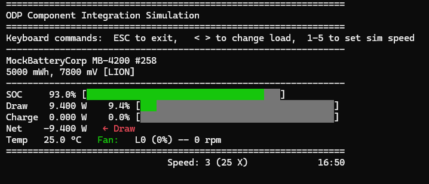

# In Place Rendering

At the start of this integration example series, we discussed how this application would serve as output both for logging changes, as an interactive simulator display, and as an integration test. We have so far implemented the logging display mode, which provides a useful perspective on system state changes over time. But we also want to implement the in-place rendering mode, which will provide a more interactive experience.

We'll walk through this here -- but this is not a part of component design per-se, and certainly not something that would be part of an embedded system -- this is just "eye-candy" that makes the use of the interactive simulation a little more comfortable.  The code presented here is drop-in, so you don't need to worry about understanding ANSI control codes and other minutia of this part of the application.

As you might guess, the key to implementing the in-place rendering mode lies in completing the implementation of the `display_render/in_place_render.rs` file.  Like its already-completed counterpart, `log_render.rs`, this file implements the `DisplayRenderer` trait.  The key difference is that instead of printing out log lines, it will use terminal control codes to update the display in place.

### ANSI Escape Codes
The `InPlace` mode will use ANSI escape codes to control the terminal display. These are special sequences of characters that the terminal interprets as commands rather than text to display. For example, the sequence `\x1B[2J` clears the screen, and `\x1B[H` moves the cursor to the home position (top-left corner). By using these codes, we can create a dynamic display that updates in place.  We will also make use of colors to enhance the visual experience, and use percentage bars to represent values as well as numerical data.

### ANSI Helpers and support
We will start our `in_place_render.rs` implementation by establishing some helper functions and definitions we will use for our rendering.

Replace the current placeholder content of `in_place_render.rs` with the following code.  There are a lot of definitions here that define the specific escape code patterns to achieve ANSI terminal effects and colors.  There's also some helper code for rendering pseudo-graphical elements using these techniques. Don't worry too much about these now:
```rust
use crate::display_render::display_render::{RendererBackend, time_fmt_from_ms};
use crate::display_models::{StaticValues,DisplayValues,InteractionValues,Thresholds};

// ==== helpers for ANSI positional rendering ====

#[inline]
fn goto(row: u16, col: u16) { print!("\x1b[{};{}H", row, col); } // 1-based
#[inline]
fn clear_line() { print!("\x1b[K");}
#[inline]
fn hide_cursor() { print!("\x1b[?25l"); }
#[inline]
fn show_cursor() { print!("\x1b[?25h"); }
#[inline]
fn clear_screen() { print!("\x1b[2J\x1b[H"); } // clear + home

// ==== ANSI helpers ====
#[inline] fn reset() -> &'static str { "\x1b[0m" }
#[inline] fn bold()  -> &'static str { "\x1b[1m" }

#[inline] fn panel() { print!("{}{}", bg(BG_PANEL), fg(FG_DEFAULT)); }
#[inline] fn clear_line_panel() { panel(); clear_line(); }
#[inline] fn line_start(row: u16, col: u16) { goto(row, col); clear_line_panel(); }

#[inline] fn fg(code: u8) -> String    { format!("\x1b[{}m", code) }        // 30–37,90–97
#[inline] fn bg(code: u8) -> String    { format!("\x1b[{}m", code) }        // 40–47,100–107

// 8/16-color palette picks that read well on most terminals:
const FG_DEFAULT: u8 = 97;   // bright white
const BG_PANEL:   u8 = 40;   // black bg to isolate our content panel
const FG_GOOD:    u8 = 92;   // bright green
const BG_GOOD:    u8 = 42;   // green bg
const FG_WARN:    u8 = 93;   // bright yellow
const BG_WARN:    u8 = 43;   // yellow bg
const FG_DANGER:  u8 = 91;   // bright red
const BG_DANGER:  u8 = 41;   // red bg
const BG_EMPTY:   u8 = 100;  // bright black/gray for bar remainder


#[derive(Clone, Copy)]
struct ZoneColors { fg: u8, bg: u8 }

/// Pick a color zone based on value relative to warn/danger.
/// If `good_is_high == true`, larger is greener (SOC, charge).
/// If `good_is_high == false`, larger is worse (Temp, Draw).
fn pick_zone(value: f32, warn: f32, danger: f32, good_is_high: bool) -> ZoneColors {
    let (good, warn_c, danger_c) = (
        ZoneColors { fg: FG_GOOD,   bg: BG_GOOD   },
        ZoneColors { fg: FG_WARN,   bg: BG_WARN   },
        ZoneColors { fg: FG_DANGER, bg: BG_DANGER },
    );

    if good_is_high {
        if value <= danger { danger_c }
        else if value <= warn { warn_c }
        else { good }
    } else {
        // higher is worse: reverse comparisons
        if value >= danger { danger_c }
        else if value >= warn { warn_c }
        else { good }
    }
}

/// Render a solid block bar with colorized background for the fill,
/// neutral gray background for the remainder, and visible brackets.
fn block_bar(frac: f32, width: usize, fill_zone: ZoneColors) -> String {
    let frac = frac.clamp(0.0, 1.0);
    let fill = core::cmp::min((frac * width as f32).round() as usize, width);

    let mut s = String::with_capacity(width + 10);

    // Bracket left in panel colors
    s.push_str(&fg(FG_DEFAULT)); s.push_str(&bg(BG_PANEL)); s.push('[');

    // Filled segment
    if fill > 0 {
        s.push_str(&fg(fill_zone.fg));
        s.push_str(&bg(fill_zone.bg));
        for _ in 0..fill { s.push('█'); }
    }

    // Empty remainder (neutral background for readability)
    if fill < width {
        s.push_str(&fg(FG_DEFAULT));
        s.push_str(&bg(BG_EMPTY));
        for _ in fill..width { s.push(' '); }
    }

    // Bracket right back to panel bg
    s.push_str(&fg(FG_DEFAULT)); s.push_str(&bg(BG_PANEL)); s.push(']');
    s.push_str(reset());
    s
}


// ======
const ROW_TITLE: u16 = 1;
const ROW_HELP: u16 = 4;
const ROW_INFO1: u16 = 6;  // manufacturer / name / serial / chem
const ROW_INFO2: u16 = 7;  // voltage, capacity
const ROW_LINE:  u16 = 8;  // separator
const ROW_SOC:   u16 = 9;  // dynamic begins here
const ROW_DRAW:  u16 = 10;
const ROW_CHG:   u16 = 11;
const ROW_NET:   u16 = 12;
const ROW_TEMP:  u16 = 13;
const ROW_LINE2: u16 = 14;
const ROW_TIME:  u16 = 15;
const ROW_LOG:   u16 = 18;

const COL_LEFT: u16 = 2;
const COL_SPEED: u16 = COL_LEFT + 30;
const COL_TIME: u16 = COL_LEFT + 58;
const BAR_W: usize = 36;
```
This code will set us up with the basic building blocks we need to create our in-place rendering.  We have defined a set of ANSI escape code helpers for cursor movement, screen clearing, and color setting.  We have also defined some constants for colors that work well together on most terminals, as well as functions to pick colors based on value zones (good, warning, danger) and to render a block bar with colorized segments.
We have also defined constants for the row and column positions of various elements in our display, which will help us position our output correctly.  

Now we can implement our `InPlaceBackend` struct and its `RendererBackend` trait methods, including the all-important `render_frame()` method that updates dynamic changes to the display, and the `render_static()` method that sets up the static parts of the display at the beginning, and gives us a key command 'help' reference.

```rust
pub struct InPlaceBackend { 
    th: Thresholds
}
impl InPlaceBackend {
    pub fn new() -> Self { 
        Self {
            th:Thresholds::new()
        } 
    }
}
impl RendererBackend for InPlaceBackend {
    fn on_enter(&mut self, last: Option<&DisplayValues>) {
        // any setup or restore necessary
        let _ = last;
        clear_screen();
        hide_cursor(); 
        // Set a consistent panel background + default bright text
        print!("{}{}", bg(BG_PANEL), fg(FG_DEFAULT));        
    }
    fn on_exit(&mut self) {
        // teardown 
        print!("{}", reset());
        clear_screen();
        show_cursor(); 
    }
    fn render_frame(&mut self, dv: &DisplayValues, ia: &InteractionValues) {
        // keep panel colors active
        print!("{}{}", bg(BG_PANEL), fg(FG_DEFAULT));

        let max_w = self.th.max_load.max(1.0);

        // Split for display only (both non-negative)
        let draw_w   = dv.draw_watts.max(0.0);
        let charge_w = dv.charge_watts.max(0.0);
        let net_w    = dv.net_watts;

        let draw_frac   = (draw_w   / max_w).clamp(0.0, 1.0);
        let charge_frac = (charge_w / max_w).clamp(0.0, 1.0);
        let soc_frac    = (dv.soc_percent / 100.0).clamp(0.0, 1.0);

        let (speed_number, speed_multiplier) = ia.get_speed_number_and_multiplier();

        // === SOC (good is high: warn/danger are lower thresholds) ===
        let soc_zone = pick_zone(
            dv.soc_percent,
            self.th.warning_charge,
            self.th.danger_charge,
            true
        );

        line_start(ROW_SOC, COL_LEFT);
        print!("SOC    {:5.1}% ", dv.soc_percent);
        println!("{}", block_bar(soc_frac, BAR_W, soc_zone));

        // === Draw (higher is worse) ===
        let draw_zone = pick_zone(
            draw_w,
            self.th.max_load * 0.5,    // tweakable: 50% = warn
            self.th.max_load * 0.8,    // tweakable: 80% = danger
            false
        );
        line_start(ROW_DRAW, COL_LEFT);
        print!("Draw  {:7.3} W  {:5.1}% ", draw_w, draw_frac * 100.0);
        println!("{}", block_bar(draw_frac, BAR_W, draw_zone));

        // === Charge ===
        let chg_zone = pick_zone(
            charge_w,
            draw_w,                     // warn if only charging == draw
            draw_w *0.8,             // danger of running out if charge < draw
            true
        );
        line_start(ROW_CHG, COL_LEFT);
        print!("Charge{:7.3} W  {:5.1}% ", charge_w, charge_frac * 100.0);
        println!("{}", block_bar(charge_frac, BAR_W, chg_zone));

        // === Net (color arrow by direction) ===
        let dir = if net_w >= 0.0 {
            format!("{}→ Charge{}", fg(FG_GOOD), reset())
        } else {
            format!("{}← Draw{}",   fg(FG_DANGER), reset())
        };
        // keep panel colors around printed arrow
        let _ = print!("{}{}", bg(BG_PANEL), fg(FG_DEFAULT));
        line_start(ROW_NET, COL_LEFT);
        println!("Net   {:+7.3} W   {}", net_w, dir);

        // === Temp/Fan (higher is worse) ===
        let temp_zone = pick_zone(
            dv.temp_c,
            self.th.warning_temp,
            self.th.danger_temp,
            false
        );
        line_start(ROW_TEMP, COL_LEFT);
        print!("Temp  {:5.1} °C   ", dv.temp_c);
        print!("{}{}Fan:  ", fg(temp_zone.fg), bg(BG_PANEL));
        print!("{}{}", bg(BG_PANEL), fg(FG_DEFAULT));
        println!(" {} rpm", dv.fan_rpm);

        // line + footer
        line_start(ROW_LINE2, COL_LEFT);
        println!("===============================================================");
        goto(ROW_TIME, COL_SPEED); clear_line();
        println!("Speed: {} ({} X)", speed_number, speed_multiplier);
        goto(ROW_TIME, COL_TIME); clear_line();
        println!("{}", time_fmt_from_ms(dv.sim_time_ms));

        // log area
        line_start(ROW_LOG, COL_LEFT);
    }

     fn render_static(&mut self, sv: &StaticValues) {
        clear_screen();
        // re-assert panel colors
        print!("{}{}", bg(BG_PANEL), fg(FG_DEFAULT));

        goto(ROW_TITLE, COL_LEFT);
        println!("===============================================================");
        goto(ROW_TITLE+1, COL_LEFT);
        println!("{}ODP Component Integration Simulation{}", bold(), reset());
        print!("{}{}", bg(BG_PANEL), fg(FG_DEFAULT));
        goto(ROW_TITLE+2, COL_LEFT);
        println!("===============================================================");
        goto(ROW_HELP, COL_LEFT); clear_line();
        println!("Keyboard commands:  ESC to exit,   < > to change load,  1-5 to set sim speed");
        goto(ROW_HELP+1, COL_LEFT); clear_line();
        println!("---------------------------------------------------------------");
        goto(ROW_INFO1, COL_LEFT); clear_line();
        println!("{} {} #{}", sv.battery_mfr, sv.battery_name, sv.battery_serial);
        goto(ROW_INFO2, COL_LEFT); clear_line();
        println!("{} mWh, {} mV [{}]", sv.battery_dsgn_cap_mwh, sv.battery_dsgn_voltage_mv, sv.battery_chem);
        goto(ROW_LINE, COL_LEFT);
        println!("---------------------------------------------------------------");
    }
}
```
Finally, our `entry.rs` `render_task()` function is currently set to the default of `RenderMode::Log`.  We can change that to `RenderMode::InPlace` to use our new renderer:
```rust
    let mut r = DisplayRenderer::new(RenderMode::InPlace);
```
We can also toggle between log and in-place modes by pressing the 'D' key while the simulation is running, but this starts us of in an application-like mode right away.

When you run your display should now look like this:


You can use the <> or left/right arrow keys to raise or lower the system load, and the number keys 1-5 to set the speed of time progression. The display updates in place, providing a more interactive experience. To toggle between this display and the logging mode, press `d`.  When you are done, you can hit `q` or `Esc` to exit the simulation instead of resorting to `ctrl-c`.

You now have a interactive simulation application to test the behavior of your integrated components over a range of conditions. This type of app is a powerful tool for understanding how your components work together, and for identifying any issues that may arise in real-world usage.

Next up, we'll use what we have learned from these interactions to devise some automated tests to validate the integration in an unattended way.

