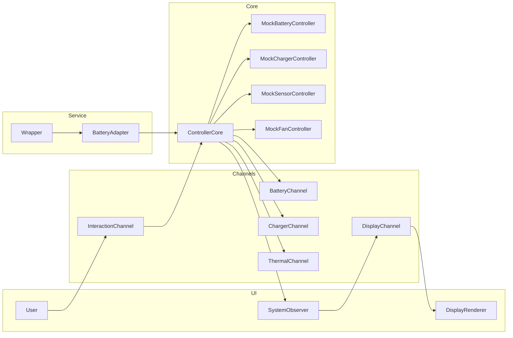

# Setup and Tap
Before we can construct our `ControllerCore` structure, we need to have the allocations of the components ready.
We choose not to pass these around beyond constructing them into a single location, since we may run into borrow violations if we hand the references out too liberally, like we have seen in our previous integration attempts.

This becomes even more complicated by the fact that when we commit our Battery Controller object to the battery service, we pass ownership to it -- and therefore lose access to our own construction.   The solution here is to not give the battery service control of our Battery directly, but to give it a `BatteryAdapter` that looks like a battery, but instead simply forwards all of its actions to our `ControllerCore`.  We call this "tapping" the service. In the `ControllerCore` we have access to not only our own battery, but also our charger and thermal components, so we can conduct our integration in a unified way.  That said, we will still avoid tightly-coupled access between components as much as possible in favor of using messaging, because this pattern fosters better modularity.

## In a view
The diagram below shows the ownership and message flow at a glance:



### The setup_and_tap code

Create `setup_and_tap.rs` and give it this content to start:
```rust
use embassy_executor::Spawner;
use embassy_time::Duration;
use static_cell::StaticCell;
use embassy_sync::once_lock::OnceLock;
use ec_common::mutex::{Mutex, RawMutex};

use crate::entry::{Shared, BATTERY_DEV_NUM, CHARGER_DEV_NUM, SENSOR_DEV_NUM, FAN_DEV_NUM};
use crate::controller_core::ControllerCore;

use embedded_services::init;
use embedded_services::power::policy::register_device;
use embedded_services::power::policy::DeviceId;
use embedded_services::power::policy::device::Device as PolicyDevice;

use mock_battery::mock_battery_device::MockBatteryDevice;
use mock_battery::mock_battery_controller::MockBatteryController;

use mock_charger::mock_charger_device::MockChargerDevice;
use mock_charger::mock_charger_controller::MockChargerController;
use embedded_services::power::policy::charger::Device as ChargerDevice; // disambiguate from other device types
use embedded_services::power::policy::charger::ChargerId;

use mock_thermal::mock_sensor_device::MockSensorDevice;
use mock_thermal::mock_fan_device::MockFanDevice;
use mock_thermal::mock_sensor_controller::MockSensorController;
use mock_thermal::mock_fan_controller::MockFanController;

use battery_service::wrapper::Wrapper;

use crate::battery_adapter::BatteryAdapter;

// ---------- statics that must live for 'static tasks ----------
static BATTERY_WRAPPER: StaticCell<Wrapper<'static, BatteryAdapter>> = StaticCell::new();

static BATTERY_DEVICE: StaticCell<MockBatteryDevice> = StaticCell::new();
static BATTERY_POLICY_DEVICE: StaticCell<PolicyDevice> = StaticCell::new();

static CHARGER_DEVICE: StaticCell<MockChargerDevice> = StaticCell::new();
static CHARGER_POLICY_DEVICE: StaticCell<MockChargerDevice> = StaticCell::new();
static CHARGER_SERVICE_DEVICE: OnceLock<ChargerDevice> = OnceLock::new();


static SENSOR_DEVICE: StaticCell<MockSensorDevice> = StaticCell::new();
static SENSOR_POLICY_DEVICE: StaticCell<MockSensorDevice> = StaticCell::new();
static FAN_DEVICE:    StaticCell<MockFanDevice>    = StaticCell::new();
static FAN_POLICY_DEVICE:    StaticCell<MockFanDevice>    = StaticCell::new();

/// Initialize registration of all the integration components
#[embassy_executor::task]
pub async fn setup_and_tap_task(spawner: Spawner, shared: &'static Shared) {
    println!("⚙️ Initializing embedded-services");
    init().await;

    println!("⚙️ Spawning battery service task");
    spawner.spawn(battery_service::task()).unwrap();

    // ----------------- Device/controller construction -----------------
    let battery_dev = BATTERY_DEVICE.init(MockBatteryDevice::new(DeviceId(BATTERY_DEV_NUM)));
    let battery_policy_dev = BATTERY_POLICY_DEVICE.init(PolicyDevice::new(DeviceId(BATTERY_DEV_NUM)));

    // Build the battery controller locally and MOVE it into the wrapper below.
    // (No StaticCell needed for the controller since the wrapper will own it.)
    let battery_controller = MockBatteryController::new(battery_dev);

    // Similar for others, although they are not moved into wrapper
    let charger_dev = CHARGER_DEVICE.init(MockChargerDevice::new(DeviceId(CHARGER_DEV_NUM)));
    let charger_policy_dev = CHARGER_POLICY_DEVICE.init(MockChargerDevice::new(DeviceId(CHARGER_DEV_NUM)));
    let charger_controller = MockChargerController::new(charger_dev);


    // Thermal (controllers own their devices)
    let sensor_dev = SENSOR_DEVICE.init(MockSensorDevice::new(DeviceId(SENSOR_DEV_NUM)));
    let sensor_policy_dev = SENSOR_POLICY_DEVICE.init(MockSensorDevice::new(DeviceId(SENSOR_DEV_NUM)));
    let fan_dev    = FAN_DEVICE.init(MockFanDevice::new(DeviceId(FAN_DEV_NUM)));
    let fan_policy_dev    = FAN_POLICY_DEVICE.init(MockFanDevice::new(DeviceId(FAN_DEV_NUM)));
    let sensor_controller = MockSensorController::new(sensor_dev);
    let fan_controller    = MockFanController::new(fan_dev);

    let charger_service_device: &'static ChargerDevice = CHARGER_SERVICE_DEVICE.get_or_init(|| ChargerDevice::new(ChargerId(CHARGER_DEV_NUM)));

    // Then use these to create our ControllerTap handler, which isolates ownership of all but the battery, which is
    // owned by the Wrapper.  We can access the other "real" controllers upon battery message receipts by the Tap.
    // We must still stick to message passing to communicate between components to preserve modularity.
    let controller_core = ControllerCore::new(
        battery_controller, charger_controller, sensor_controller, fan_controller,
        charger_service_device, 
        shared.battery_channel,shared.charger_channel,shared.thermal_channel,shared.interaction_channel,
        shared.observer,
    );

    static TAP_CELL: StaticCell<Mutex<RawMutex, ControllerCore>> = StaticCell::new();
    let core_mutex: &'static Mutex<RawMutex, ControllerCore> = TAP_CELL.init(Mutex::new(controller_core));
    let battery_adapter = BatteryAdapter::new(core_mutex);


    // ----------------- Battery wrapper -----------------
    println!("⚙️ Spawning battery wrapper task");
    let wrapper = BATTERY_WRAPPER.init(Wrapper::new(
        shared.battery_fuel,        // &'static BatteryDevice, provided by Instances
        battery_adapter            // move ownership into the wrapper
    ));
    spawner.spawn(battery_wrapper_task(wrapper)).unwrap();

    // Registrations
    println!("🧩 Registering battery device...");
    register_device(battery_policy_dev).await.unwrap();

    println!("🧩 Registering charger device...");
    register_device(charger_policy_dev).await.unwrap();

    println!("🧩 Registering sensor device...");
    register_device(sensor_policy_dev).await.unwrap();

    println!("🧩 Registering fan device...");
    register_device(fan_policy_dev).await.unwrap();

    // ----------------- Fuel gauge / ready -----------------
    println!("🔌 Initializing battery fuel gauge service...");
    battery_service::register_fuel_gauge(&shared.battery_fuel).await.unwrap();

    spawner.spawn(battery_start_task()).unwrap();

    // signal that the battery fuel service is ready
    shared.battery_ready.signal();

    println!("Setup and Tap calling ControllerCore::start...");
    ControllerCore::start(core_mutex, spawner);

}
```
This starts out by allocating and creating the components that we will need, starting with the aforementioned `BatteryAdapter`, which we will implement in a moment, and creating the `BatteryWrapper` with this in mind.

It then creates the battery, charger, sensor, and fan components.  You may notice that in doing so we create both a DEVICE and a POLICY_DEVICE for each.  Both of these Device type wrappers are identical per component.  One is used to create the controller, and one is used to register the device with the service. Since these are tied by Id designation, they are equivalent, and since we can't pass a single instance twice without incurring a borrow violation, we use this technique.

This brings us to the construction of the `ControllerCore`.  Here, we give it all of the components, plus the comm channels that were shared from our earlier allocations in `entry.rs`.  We also see here we are passing references to a new channel `integration_channel`, and the `SystemObserver`, neither of which we have created yet.

Once we get our `ControllerCore` instance created, we wrap it into a mutex that we stash into a `StaticCell` so that we have portable access to this structure.

The remainder of the `setup_and_tap_task` proceeds with registration and then spawning the execution tasks.
