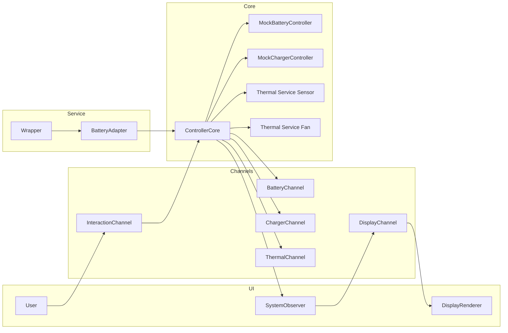

# Setup and Tap
Before we can construct our `ControllerCore` structure, we need to have the allocations of the components ready.
We choose not to pass these around beyond constructing them into a single location, since we may run into borrow violations if we hand the references out too liberally, like we have seen in our previous integration attempts.

This becomes even more complicated by the fact that when we commit our Battery Controller object to the battery service, we pass ownership to it -- and therefore lose access to our own construction.   The solution here is to not give the battery service control of our Battery directly, but to give it a `BatteryAdapter` that looks like a battery, but instead simply forwards all of its actions to our `ControllerCore`.  We call this "tapping" the service. In the `ControllerCore` we have access to not only our own battery, but also our charger and thermal components, so we can conduct our integration in a unified way.  That said, we will still avoid tightly-coupled access between components as much as possible in favor of using messaging, because this pattern fosters better modularity.

## In a view
The diagram below shows the ownership and message flow at a glance:



### The setup_and_tap code

Create `setup_and_tap.rs` and give it this content to start:
```rust
use embassy_executor::Spawner;
use embassy_time::Duration;
use static_cell::StaticCell;
use embassy_sync::once_lock::OnceLock;
use ec_common::mutex::{Mutex, RawMutex};

use crate::entry::{Shared, BATTERY_DEV_NUM, CHARGER_DEV_NUM, SENSOR_DEV_NUM, FAN_DEV_NUM};
use crate::controller_core::ControllerCore;

use embedded_services::init;
use embedded_services::power::policy::register_device;
use embedded_services::power::policy::DeviceId;
use embedded_services::power::policy::device::Device as PolicyDevice;

use mock_battery::mock_battery_device::MockBatteryDevice;
use mock_battery::mock_battery_controller::MockBatteryController;

use mock_charger::mock_charger_device::MockChargerDevice;
use mock_charger::mock_charger_controller::MockChargerController;
use embedded_services::power::policy::charger::Device as ChargerDevice; // disambiguate from other device types
use embedded_services::power::policy::policy::register_charger;
use embedded_services::power::policy::charger::ChargerId;

use mock_thermal::mock_sensor_device::MockSensorDevice;
use mock_thermal::mock_fan_device::MockFanDevice;
use mock_thermal::mock_sensor_controller::MockSensorController;
use mock_thermal::mock_fan_controller::MockFanController;

use battery_service::wrapper::Wrapper;

use crate::battery_adapter::BatteryAdapter;

use thermal_service as ts;
use ts::sensor as tss;
use ts::fan   as tsf;

pub const INTERNAL_SAMPLE_BUF_LENGTH:usize =  16; // must be a power of 2

// ---------- statics that must live for 'static tasks ----------
static BATTERY_WRAPPER: StaticCell<Wrapper<'static, BatteryAdapter>> = StaticCell::new();

static BATTERY_DEVICE: StaticCell<MockBatteryDevice> = StaticCell::new();
static BATTERY_POLICY_DEVICE: StaticCell<PolicyDevice> = StaticCell::new();

static CHARGER_DEVICE: StaticCell<MockChargerDevice> = StaticCell::new();
static CHARGER_POLICY_DEVICE: StaticCell<MockChargerDevice> = StaticCell::new();
static CHARGER_SERVICE_DEVICE: OnceLock<ChargerDevice> = OnceLock::new();


static SENSOR_DEVICE: StaticCell<MockSensorDevice> = StaticCell::new();
static FAN_DEVICE:    StaticCell<MockFanDevice>    = StaticCell::new();

static TS_SENSOR: StaticCell<tss::Sensor<mock_thermal::mock_sensor_controller::MockSensorController, {INTERNAL_SAMPLE_BUF_LENGTH}>> = StaticCell::new();
static TS_FAN:    StaticCell<tsf::Fan<mock_thermal::mock_fan_controller::MockFanController, {INTERNAL_SAMPLE_BUF_LENGTH}>>          = StaticCell::new();

// Generate Embassy tasks for concrete controller types.
ts::impl_sensor_task!(
    thermal_sensor_task,
    mock_thermal::mock_sensor_controller::MockSensorController,
    INTERNAL_SAMPLE_BUF_LENGTH
);

ts::impl_fan_task!(
    thermal_fan_task,
    mock_thermal::mock_fan_controller::MockFanController,
    INTERNAL_SAMPLE_BUF_LENGTH
);

use crate::config::policy_config::ThermalPolicyCfg;


pub fn make_sensor_profile(p: &ThermalPolicyCfg) -> tss::Profile {
    tss::Profile {
        // thresholds
        warn_low_threshold:  p.temp_low_on_c,
        warn_high_threshold: p.temp_high_on_c,
        prochot_threshold:   p.sensor_prochot_c,
        crt_threshold:       p.sensor_crt_c,

        // debouncing
        hysteresis: p.sensor_hysteresis_c,

        // sampling
        sample_period:         p.sensor_sample_period_ms,
        fast_sample_period:    p.sensor_fast_sample_period_ms,
        fast_sampling_threshold: p.sensor_fast_sampling_threshold_c,

        // misc
        offset: 0.0,
        retry_attempts: 5,

        ..Default::default()
    }
}

pub fn make_fan_profile(p: &ThermalPolicyCfg, sensor_id: tss::DeviceId) -> tsf::Profile {
    tsf::Profile {
        sensor_id,

        // ramp shape
        on_temp:    p.fan_on_temp_c,
        ramp_temp:  p.fan_ramp_temp_c,
        max_temp:   p.fan_max_temp_c,
        hysteresis: p.fan_hyst_c,

        // control
        auto_control: p.fan_auto_control,

        // sampling/update cadences
        sample_period: p.fan_sample_period_ms,
        update_period: p.fan_update_period_ms,

        ..Default::default()
    }
}

/// Initialize registration of all the integration components
#[embassy_executor::task]
pub async fn setup_and_tap_task(spawner: Spawner, shared: &'static Shared) {
    println!("⚙️ Initializing embedded-services");
    init().await;

    println!("⚙️ Spawning battery service task");
    spawner.spawn(battery_service::task()).unwrap();

    // ----------------- Device/controller construction -----------------
    let battery_dev = BATTERY_DEVICE.init(MockBatteryDevice::new(DeviceId(BATTERY_DEV_NUM)));
    let battery_policy_dev = BATTERY_POLICY_DEVICE.init(PolicyDevice::new(DeviceId(BATTERY_DEV_NUM)));

    // Build the battery controller locally and MOVE it into the wrapper below.
    // (No StaticCell needed for the controller since the wrapper will own it.)
    let battery_controller = MockBatteryController::new(battery_dev);

    // Similar for others, although they are not moved into wrapper
    let charger_dev = CHARGER_DEVICE.init(MockChargerDevice::new(ChargerId(CHARGER_DEV_NUM)));
    let charger_policy_dev = CHARGER_POLICY_DEVICE.init(MockChargerDevice::new(ChargerId(CHARGER_DEV_NUM)));
    let charger_controller = MockChargerController::new(charger_dev);


    // Thermal (controllers own their devices)
    let sensor_dev = SENSOR_DEVICE.init(MockSensorDevice::new(DeviceId(SENSOR_DEV_NUM)));
    let fan_dev    = FAN_DEVICE.init(MockFanDevice::new(DeviceId(FAN_DEV_NUM)));

    // Build profiles from config
    let thermal_cfg = ThermalPolicyCfg::default();
    let sensor_profile = make_sensor_profile(&thermal_cfg);
    let fan_profile    = make_fan_profile(&thermal_cfg,
                                      tss::DeviceId(SENSOR_DEV_NUM as u8));
    // create controllers
    let sensor_controller = MockSensorController::new(sensor_dev);
    let fan_controller    = MockFanController::new(fan_dev);

    // build ODP registration-ready wrappers for these    
    let sensor = TS_SENSOR.init(tss::Sensor::new(
        tss::DeviceId(SENSOR_DEV_NUM as u8),
        sensor_controller,
        sensor_profile,
    ));
    let fan = TS_FAN.init(tsf::Fan::new(
        tsf::DeviceId(FAN_DEV_NUM as u8),
        fan_controller,
        fan_profile,
    ));

    println!("🌡️ Initializing thermal service");
    thermal_service::init().await.unwrap(); 

    // Register with the thermal service
    println!("🧩 Registering sensor device to thermal service...");
    ts::register_sensor(sensor.device()).await.unwrap();
    println!("🧩 Registering fan device to thermal service...");
    ts::register_fan(fan.device()).await.unwrap();


    // Spawn the ODP thermal tasks (these tasks created by ts::impl_ macros at module scope above)
    spawner.must_spawn(thermal_sensor_task(sensor));
    spawner.must_spawn(thermal_fan_task(fan));
    // To support MPTF/host messages:
    spawner.must_spawn(ts::mptf::handle_requests());

    let charger_service_device: &'static ChargerDevice = CHARGER_SERVICE_DEVICE.get_or_init(|| ChargerDevice::new(ChargerId(CHARGER_DEV_NUM)));

    // Then use these to create our ControllerTap handler, which isolates ownership of all but the battery, which is
    // owned by the Wrapper.  We can access the other "real" controllers upon battery message receipts by the Tap.
    // We must still stick to message passing to communicate between components to preserve modularity.
    let controller_core = ControllerCore::new(
        battery_controller, charger_controller, sensor, fan,
        charger_service_device, 
        shared.battery_channel,shared.charger_channel,shared.thermal_channel,shared.interaction_channel,
        shared.observer,
    );

    static TAP_CELL: StaticCell<Mutex<RawMutex, ControllerCore>> = StaticCell::new();
    let core_mutex: &'static Mutex<RawMutex, ControllerCore> = TAP_CELL.init(Mutex::new(controller_core));
    let battery_adapter = BatteryAdapter::new(core_mutex);


    // ----------------- Battery wrapper -----------------
    println!("⚙️ Spawning battery wrapper task");
    let wrapper = BATTERY_WRAPPER.init(Wrapper::new(
        shared.battery_fuel,        // &'static BatteryDevice, provided by Instances
        battery_adapter            // move ownership into the wrapper
    ));
    spawner.spawn(battery_wrapper_task(wrapper)).unwrap();

    // Registrations
    println!("🧩 Registering battery device...");
    register_device(battery_policy_dev).await.unwrap();

    println!("🧩 Registering charger device...");
    register_charger(charger_policy_dev).await.unwrap();

    // ----------------- Fuel gauge / ready -----------------
    println!("🔌 Initializing battery fuel gauge service...");
    battery_service::register_fuel_gauge(&shared.battery_fuel).await.unwrap();

    spawner.spawn(battery_start_task()).unwrap();

    // insure launched tasks have started running before we execute request
    embassy_futures::yield_now().await;

    // Turn on auto control for fan
    println!("💡Turning on Fan EnableAutoControl...");
    let _ = fan.device().execute_request(thermal_service::fan::Request::EnableAutoControl).await;

    // signal that the battery fuel service is ready
    shared.battery_ready.signal();

    println!("Setup and Tap calling ControllerCore::start...");
    ControllerCore::start(core_mutex, spawner);

}

```
This starts out by allocating and creating the components that we will need, starting with the aforementioned `BatteryAdapter`, which we will implement in a moment, and creating the `BatteryWrapper` with this in mind.

It then creates the battery, charger, sensor, and fan components.  You may notice that in doing so for the battery and charger, we create both a DEVICE and a POLICY_DEVICE for each.  Both of these Device type wrappers are identical per component.  One is used to create the controller, and one is used to register the device with the service. Since these are tied by Id designation, they are equivalent, and since we can't pass a single instance twice without incurring a borrow violation, we use this technique.

For the sensor and fan, we wrap our controllers in the TS_SENSOR and TS_FAN allocated statics.  These wrappers contain the controllers and device ids, and the profile configurations needed to enact the ODP prescribed thermal-service handling. We then init the thermal service and use these wrappers to register these thermal components into it.

Note the additional items at module-scope to support this.  We call upon the `ts::impl_sensor_task!` and `ts::impl_fan_task!` macros that will generate a task function we can spawn to to support these services.  We also have defined helper functions that allow us to map our policy configuration values to the ODP policy structures for these services.

This brings us to the construction of the `ControllerCore`.  Here, we give it all of the components, plus the comm channels that were shared from our earlier allocations in `entry.rs`.  We also see here we are passing references to a new channel `interaction_channel`, and the `SystemObserver`, neither of which we have created yet.

Once we get our `ControllerCore` instance created, we wrap it into a mutex that we stash into a `StaticCell` so that we have portable access to this structure.

The remainder of the `setup_and_tap_task` proceeds with registration and then spawning the execution tasks.

> -----
> ### Mind the namespaces
>
> Note the `use` statements and the namespaces for similarly named types (`Device`, `ChargerId`, `register_device`, `register_charger`, `register_fan`, etc.) 
> The ODP supported services generally use type-specific but similar sounding structures.  
> It is easy to include the wrong 'version' of a named struct from a different namespace.
> If you apply these incorrectly, you will get unexpected results.
>
> ----
