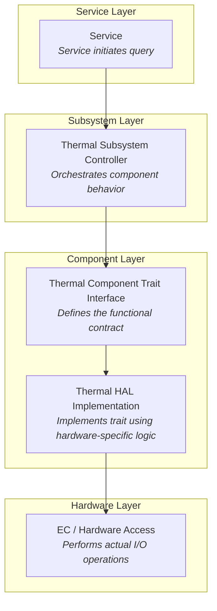

# Thermal component Diagrams

_TODO: This will mirror similar content for Battery_

The construction of a component such as our thermal subsystem looks as follows.

When in operation, it conducts its operations in response to message events

_TODO: Will be similar to battery example diagram_

