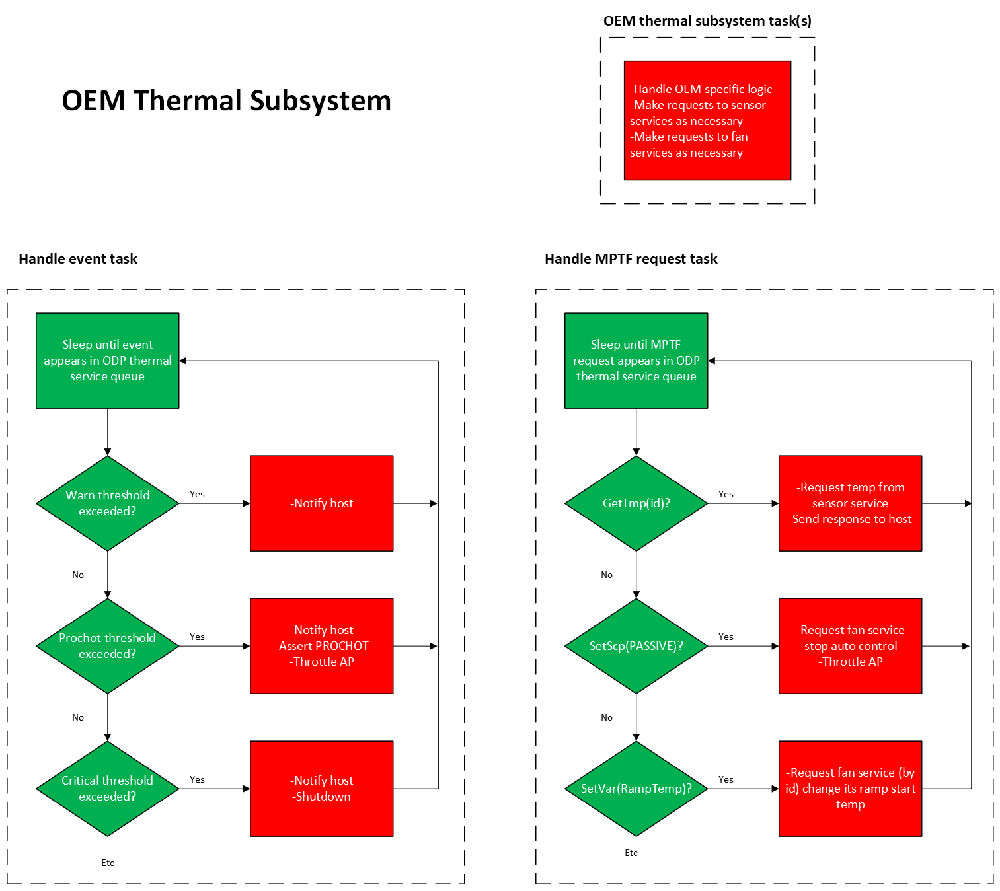

# Thermal component Diagrams

Our Thermal component subsystem will be pretty simple and basic.  It will be comprised of one temperature and one fan.  
More sensors and more fans or other thermal mitigation hardware solutions could be added to any given real-world implementation using the same patterns.

When in operation, it conducts its operations in response to message events according to behavior logic that we will define and test here.

