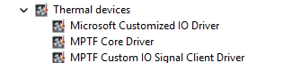
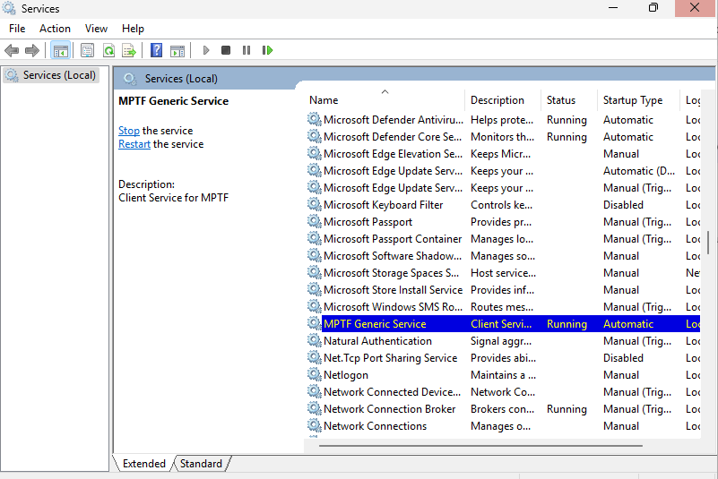
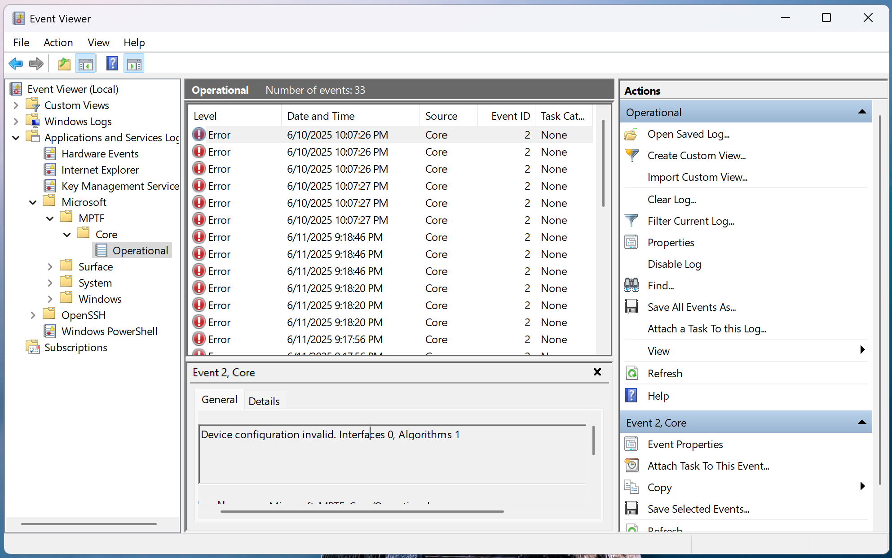

# Debugging
This section describes the order you should follow when validating the MPTF and log files to capture.

## Loading Drivers
The first step is to make sure the MPTF drivers are loaded successfully in device manager.

In device manager expand the Thermal devices tab to make sure see the following three devices listed without any yellow bang.



If you don't see the "Thermal devices" in device manager, you are either missing the ACPI entries or the files are not present in your windows folder. Review the sections on ACPI and the MPTF drivers to make sure all the files are present.

If MPTF Core Driver is present but yellow banged, this is normally because of a failure in parsing the PocIF.txt and PocSpec.txt files in the root folder. Make sure these are present and look valid or try a simpler file. If they are valid collect logs that are listed in the Logging section below and review/share.

If Microsoft Customized IO Driver is present but yellow banged, this is normally an issue with your configuration files and ACPI _DSM definitions for input and output devices. Review your ACPI entries for MSFT0011 and make sure all functions referenced in the PocIF.txt are present and valid in your ACPI tables. For further debug collect logs and see section on ACPI debugging to debug ACPI

If MPTF Custom IO Signal Client River is present but yellow banged, this indicates there is normally a problem in your custom input/output driver component. Enable logging in your driver and make sure it is loaded successfully and no failures. Enable all other logs under logging and review content.

Sometimes drivers will not load correctly if the MPTF service is not running so be sure to make sure in your service manager that MPTF service is running and set to automatically start.




## Logging

Logging has moved to EventViewer traces. To view the MPTF events open Event Viewer (eventvwr.msc) and browse to Applications and Services -> Microsoft -> Windows -> MPTF

You will see the MPTF events here for debugging and tracing behaviors.



If using secure EC services and sending commands via FFA these logs are captured to the serial port, in this case you should see the output channel value being written to the variable on the serial port logs
```
15:29:00.621 : SP 8003: DEBUG - set_variable instance id: 0x1
15:29:00.622 : SP 8003:                 length: 0x4
15:29:00.623 : SP 8003:                 uuid: 5cf839df-8be7-42b9-9ac5-3403ca2c8a6a
15:29:00.623 : SP 8003:                 data: 0x19
```

## ACPI Debugging
Since input and output devices go through ACPI calls you may find yourself needing to debug content in ACPI. 

```
!amli set spewon verboseon traceon dbgbrkon
!amli bp \_SB.CIO1._DSM
!amli bl
!amli dns /s \_SB.CIO1
```

For further details on ACPI debugging see [AMLI Debugging](https://learn.microsoft.com/en-us/windows-hardware/drivers/debugger/introduction-to-the-amli-debugger)
