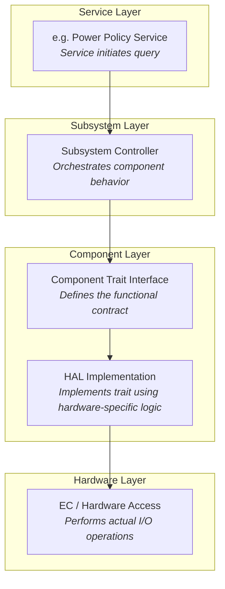

# Embedded Controller

An Embedded Controller is typically a single SOC (System on Chip) design capable of managing a number of low-level tasks.

These individual tasked components of the SOC are represented by the gold boxes in the diagram. The ODP Support for Embedded Controller development is represented in the diagram in the green boxes, whereas third party support libraries are depicted in blue.

## Component modularity
A Component can be thought of as a stack of functionality defined by traits (A trait in Rust is analogous to an interface in other common languages).
For the functionality defined by the trait definition to interact with the hardware, there must be a HAL (hardware abstraction layer) defined that implements key actions required by the hardware to conduct these tasks.  These HAL actions are then controlled by the functional interface of the component definition.  
The component definition is part of a _Subsystem_ of functionality that belongs to a _Service_.
For example, a Power Policy Service may host several related Subsystems for Battery, Charger, etc.  Each of these Subsystems have Controllers to interact with their corresponding components.  These Controllers are commanded by the Service their Subsystem belongs to, so for example, the power policy service may interrogate the current charge state of the battery. It does so by interrogating the Subsystem Controller which in turn relies upon the interface defined by the component Trait, which finally calls upon the hardware HAL to retrieve the necessary data from the hardware.  This chain of stacked concerns forms a common pattern that allows for agile modularity and flexible portability of components between target contexts.

## Secure vs Non-Secure

Communication between Subsystems may be considered to be either a "Secure" channel for data communication or a "Non-Secure" channel. An implementation may use more than one transport for different controller and controller service needs.

Data communication with the embedded controller can be considered an _owned interface_ because it is implemented within the EC architecture itself.  It may also tie into an external communication bus such as SPI or I2C for data exhanges between other MCUs or the host, but for purposes of communicating between its own subsystems, it is an internally implemented construct.  

A "Secure" transport is one that can validate and trust the data from the channel, using cryptographic signatures and hypervisor isolation to insure the integrity of the data exchanged between subsystems.
Not all such channels must necessarily be secure, and indeed in some cases depending upon the components used it may not even be possible to secure a channel.  The ODP approach is agnostic to these decisions, and can support either or both patterns of
implementation.

Depending upon the hardware architecture and available supporting features, a secure channel may incorporate strong isolation between individual component subsystems through memory access and paging mechanisms and/or hypervisor control.

Two similar sounding, but different models become known here.  One is SMM, or "System Management Mode". SMM is a high-privilege CPU mode for x86 microcontrollers that EC services can utilize to gain access. To facilitate this, the SMM itself must be secured. This is done as part of the boot time validation and attestation of SMM access policies.  With this in place, EC Services may be accessed by employing a SMM interrupt.

For A deeper dive into what SMM is, see [How SMM isolation hardens the platform](https://www.microsoft.com/en-us/security/blog/2020/11/12/system-management-mode-deep-dive-how-smm-isolation-hardens-the-platform/?msockid=1c8509b122806f6b2c281c61233a6e3e)

Another term seen about will be "SMC", or "Secure Memory Control", which is a technology often found in ARM-based architectures. In this scheme, memory is divided into secure and non-secure areas that are mutally exclusive of each other,  as well as a narrow section known as "Non-Secure Callable" which is able to call into the "Secure" area from the "Non-Secure" side. 

Secure Memory Control concepts are discussed in detail with this document: 
[TrustZone Technology for Armv8-M Architecture](https://developer.arm.com/documentation/100690/0201)

SMM or SMC adoption has design ramifications for EC Services exchanges, but also affects the decisions made around boot firmware, and we'll see these terms again when we look at ODP Patina implementations.

### Hypervisor context multiplexing
Another component of a Secure EC design is the use of a hypervisor to constrain the scope of any given component service to a walled-off virtualization context. One such discussion of such use is detailed [in this article](https://www.microsoft.com/en-us/security/blog/2018/06/05/virtualization-based-security-vbs-memory-enclaves-data-protection-through-isolation/?msockid=1c8509b122806f6b2c281c61233a6e3e)

### The Open Device Partnership defines:
- An "owned interface" that communicates with the underlying hardware via the available data transport .
- We can think of this transport as being a channel that is considered either "Secure" or "Non-Secure".  
- This interface supports business logic for operational abstractions and concrete implementations to manipulate or interrogate the connected hardware component.
- The business logic code may rely upon other crates to perform its functions. There are several excellent crates available in the Rust community that may be leveraged, such as [Embassy](https://embassy.dev/).
- Synchronous and asynchronous patterns are supported.
- No runtime or RTOS dependencies.

An implementation may look a little like this:

