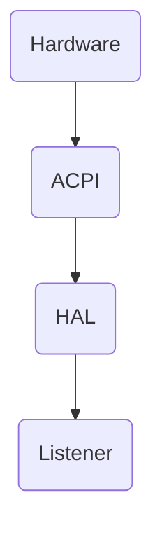

### Addressing the user button

The user button of the STM32F3 will trigger an interrupt signal that can be intercepted
by code to react to the button being pressed.

In the environment of an EC attached to an ACPI (or other transport) bus, the controller would be listening to / contributing to signals on that bus.

Recall our diagram of how EC components are attached to the bus through abstraction layers:




In this example, we’re not using an actual ACPI or I²C bus, but we can simulate the idea of signal propagation and component decoupling using shared memory and interrupts.

We'll listen to the button interrupt and place a signal into a memory address that is accessible by both our button producer and our LED consumer.  This will take the place
of the ACPI for us here.  In later excercises we'll explore the mappings to the ACPI and the ASL layers in a real Embedded Controller environment.

So let's create that button producer code.  It will wait for the interrupt that signals the button action and it will set an
AtomicBool at a location in memory named USER_BUTTON_PRESSED that we can interrogate at the listener side.


###### ButtonHandler.rs
```rust
#![no_std]
#![no_main]

extern crate panic_itm;

use cortex_m_rt::entry;

use stm32f3_discovery::stm32f3xx_hal::interrupt;
use stm32f3_discovery::stm32f3xx_hal::prelude::*;
use stm32f3_discovery::stm32f3xx_hal::pac;
use stm32f3_discovery::wait_for_interrupt;

use core::sync::atomic::{AtomicBool, Ordering};
use stm32f3_discovery::button;
use stm32f3_discovery::button::interrupt::TriggerMode;

use stm32f3_discovery::leds::Leds;
use stm32f3_discovery::switch_hal::ToggleableOutputSwitch;


// this will be imported into the listener code for direct visibility rather than transmitting through a bus
static USER_BUTTON_PRESSED: AtomicBool = AtomicBool::new(false);

#[interrupt]
fn EXTI0() {
    //If we don't clear the interrupt to signal it's been serviced, it will continue to fire.
    button::interrupt::clear();
    // pa0 has a low pass filter on it, so no need to debounce in software
    USER_BUTTON_PRESSED.store(true, Ordering::SeqCst);
}

fn main() -> ! {

    button::interrupt::enable(
        &device_periphs.EXTI,
        &device_periphs.SYSCFG,
        TriggerMode::Rising,
    );

    loop {
        wait_for_interrupt()
    }
}
```


