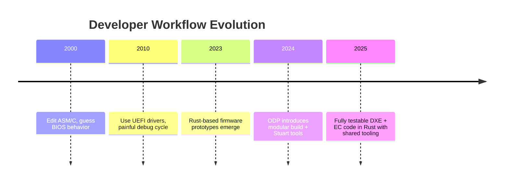

# Improved Developer Experience

ODP reduces developer friction and increases confidence, thus shortening the time to value for the development effort.

> _"Firmware development shouldn’t feel like archaeology."_

Developers can build and test components in isolation (e.g., battery, GPIO, boot timer), aided by QEMU emulation, mocks, and test harnesses.

ODP can improve developer engagement and productivity by:
- 🚀 Reducing developer friction
- 🛠️ Supporting tooling that’s approachable and efficient
- 🧪 Enabling fast iteration and confident change
- 💬 Reinforcing that firmware development is not arcane magic, just solid coding.

The Rust ecosystem brings built-in unit testing, logging, dependency control (Cargo), and static analysis.

```mermaid  
flowchart LR
  Build --> Sim["🖥️ Simulate with Mock Devices"]
  Sim --> Flash["🚀 Build & Flash"]
  Flash --> Log["📄 Review Logs / Debug"]
  Log --> Iterate["🔁 Iterate with Confidence"]
```

