# Sustainability and Long-Term Cost Reduction

ODP can help cut tech debt at its root by investing in sustainable design by enabling leaner teams and cleaner codebases.

> _“Technical debt is financial debt — just hidden in your firmware.”_

## Build right and reuse
Replacing legacy code with safer, testable, and reusable modules means lower maintenance costs over time.

```mermaid
flowchart LR
  Legacy["Legacy Stack"] --> Duplication["💥 Code Duplication"]
  Legacy --> Debugging["🐛 Opaque Bugs"]
  Legacy --> Porting["🔧 Costly Platform Bring-up"]
  Legacy --> Compliance["⚖️ Expensive Security Reviews"]
  Legacy --> Waste["🗑️ Rewrite Instead of Reuse"]
```

### HAL separation
The ability to reuse and recompose across product lines (via ODP libraries) reduces the need to "reinvent the wheel" for each board/platform, as Hardware Abstraction Layers can be cleanly isolated from the business logic of a component design, and easily expanded upon for new features.

#### More than HAL
This component philosophy extends much further than replaceable HAL layers -- it permeates throughout the component and service structure patterns ODP exposes. This allows agile modularity, greater reuseability, and shorter development cycles.

