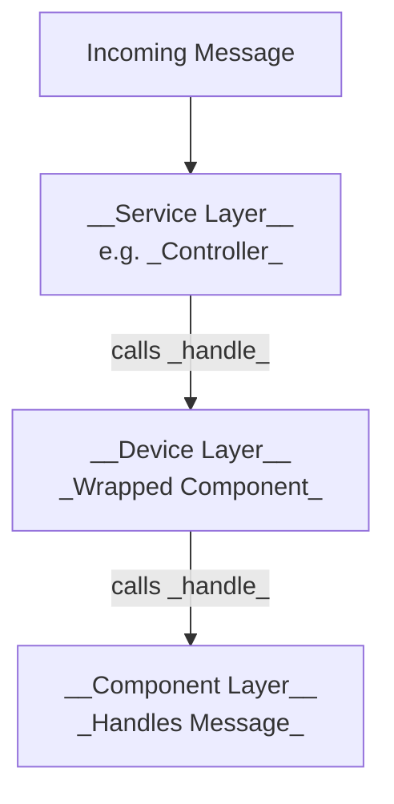

# EC Component Model

A component that implements a specification and depends upon a HAL interface.

```mermaid
flowchart TD
    A[Component]
    B[Specification Trait]
    C[HAL Trait]

    A --> B
    A --> C
 ```

  A component is housed within a subsystem, which is controlled by a service. The service orchestrates the component's behavior and manages its lifecycle.  

```mermaid
flowchart TD
    A[__Controller__ <br/> Implements Service Interface Trait]
    B[__Device__ <br/> Implements Component Type Trait]
    C[__Component__ <br/> Implements Specification Trait]

    A --> B
    B --> C

```

Component interactions are generally initiated in response to message events. The controller receives a message, which it routes to the component. The component then calls into the HAL to perform the requested operation. 


