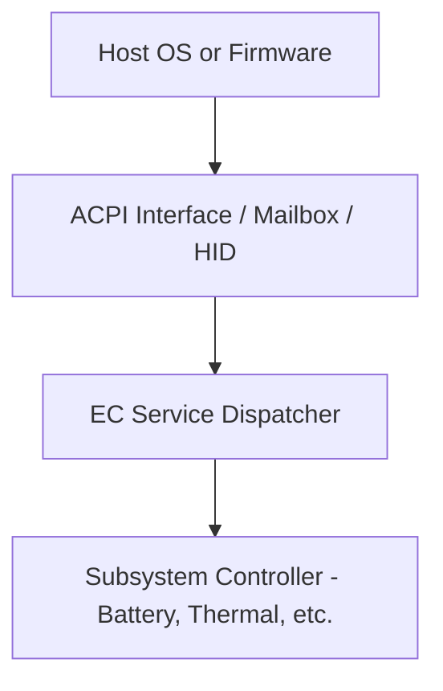
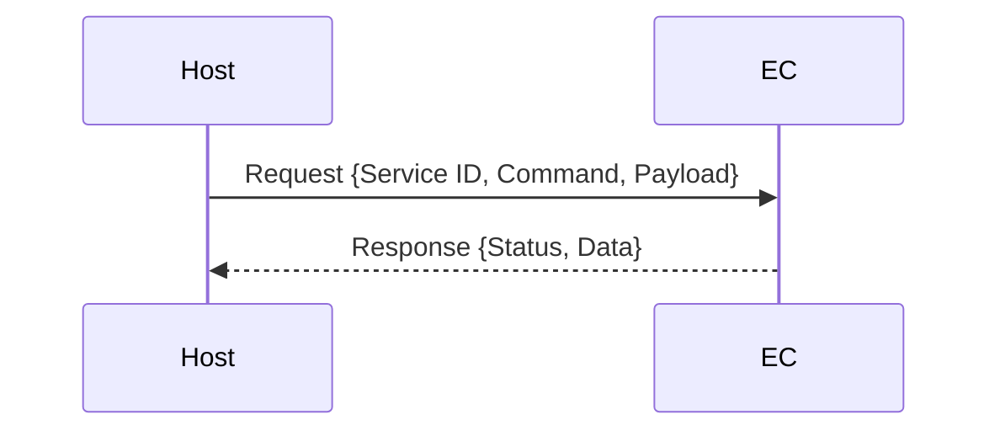
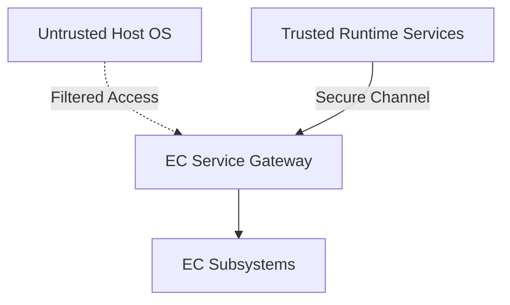

# EC Services Architecture

## Communication Pathways

> Figure: EC Service Entry Points
> Host platforms interact with EC services through one or more communication pathways. These may include ACPI-defined regions, mailbox protocols, or vendor-defined HID messages. The EC processes these via service dispatch logic.

## Messaging Exchange Format (Conceptual) 

> __Figure: Message Exchange__
>
> The diagram above illustrates the basic message handshake.
>
> This table explains the field data exchanged:
> | Field | Description |
> |-------|-------------|   
> | Service ID | Identifies target subsystem |
> | Command | Specific operation to perform |
> | Payload | Data required for operation |
> | Status | Result of operation |
> | Data | Optional result values |

## Secure and Non-Secure Implementations
In the diagram below, the dark blue sections are those elements that are part of normal (non-secure) memory space and may be called from a service interface directly.  As we can see on the Non-Secure side, the ACPI transport channel has access to the EC component implementations either directly or through the FF-A (Firmware Framework Memory Management Protocol).

Secure implementation architecture can be seen in the upcoming Security discussion.

