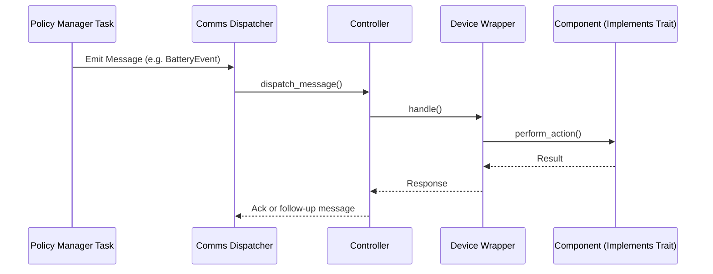

## Runtime Behaviors of an Embedded Controller

Component code is typically executed as an asynchronous task invoked by __Embassy Executor__.
A component reacts to events that are produced at higher levels of the Embedded Controller logic, through one or more policy manager tasks.

Tasks are generally event-driven actions dispatched in response to messages.

Messages are conveyed through a `comms` implementation.  Events may be handled exclusively be a single component or reacted to by more than one component. 

Messages are queued and dispatched in order but are handled asynchronously. Signaling may be required to enforce an ordered flow.

A component is wrapped within a defined `Device` wrapper that implements the traits that identify and control the implemented device type.  The `Controller` for the device reacts to various events issued at the direction of policy manager logic, and in turn invokes the component hardware in appropriate response.

