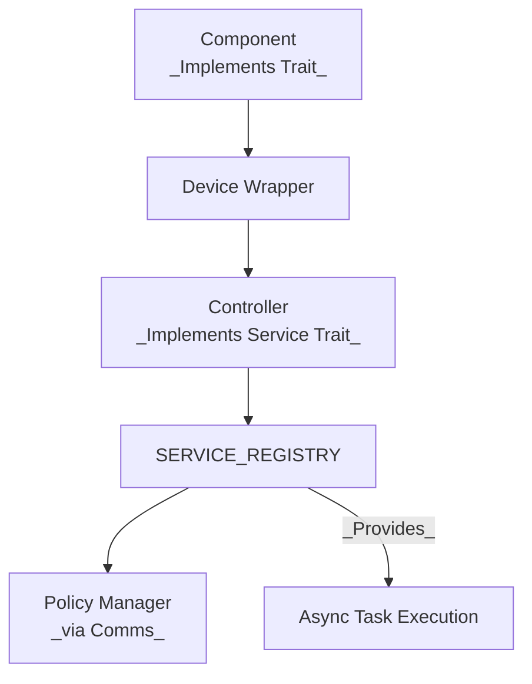

# Embedded Controller Service Registration

Embedded Controller components and services in ODP are statically composed at build time but must be registered with the **service infrastructure** to become discoverable and operational during execution.

This registration model allows each **policy domain** (e.g. power, thermal, charging) to **own and manage the devices** associated with it.

---

## Registration Pattern

The `embedded_services` crate defines the services and their policy managers. A typical registration pattern looks like this:

```rust
let battery = BATTERY.init(BatteryDevice::new(...));
let controller = BatteryController::new(battery.clone());

SERVICE_REGISTRY.register(controller);
```

- `BATTERY` is a `StaticCell` (or similar allocation) initialized at startup.

- `BatteryDevice` wraps the actual component (e.g., a `MockBattery`) and implements required traits.

- `BatteryController` implements the `Service` trait and delegates operations to the device.

- `SERVICE_REGISTRY` stores the controller and makes it accessible to both the async executor and message routing infrastructure.

### What Registration Enables
| Feature | Enabled by Registration |
|---------|------------------------|
| Message Routing | The `comms` system delivers events to services |
| Task Spawning | Services are polled and run by the executor |
| Feature Exposure | Subfeatures (e.g. _fuel_gauge_) declared via trait contracts |
| Test Visibility | Services and devices can be observed in tests |


>__Figure: Service Registration and Runtime Execution__
>
> Devices are wrapped and managed by controllers. These are registered into the service registry, which exposes them to both the message dispatcher and the async runtime for polling and task orchestration.

## Message Dispatch and Service Binding
Once a controller is registered, the service registry allows the comms system to route incoming events to the correct service based on:
- The __device ID__
- The __message type__
- The controller's implementation of the `handle()` function (_as defined by Service_)

When a message is emitted (e.g. `BatteryEvent::UpdateStatus`), the comms channel looks up the appropriate service and dispatches the message.

```rust
impl Service for BatteryController {
    async fn handle(&mut self, msg: Message) -> Result<()> {
        match msg {
            Message::Battery(BatteryEvent::UpdateStatus) => {
                self.device.update().await
            }
            _ => Ok(()),
        }
    }
}
```
This provides a flexible pattern where __services are matched to message types__ through trait implementations and static dispatch. No dynamic routing or introspection is used — behavior is known at compile time.

### Static Composition, Dynamic Coordination
While all services and components are statically bound into the final binary:
- __Message routing and task polling occur dynamically__
- __Controllers only receive messages for devices they were registered to manage__
- __Multiple services can be registered independently and coexist without conflict__

This pattern supports:
- Easy testing with mocks or alternate HALs
- Additive subsystem design (battery, charger, thermal)
- Isolated debugging of service behavior