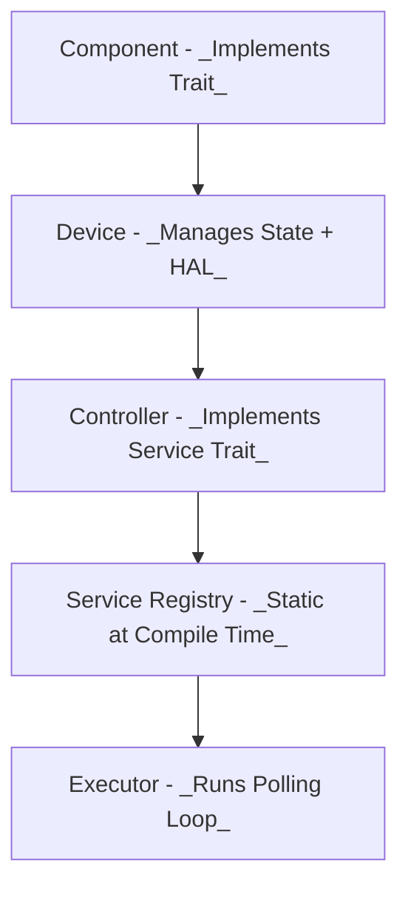

# Embedded Controller Integration

EC integration, like Patina, is performed statically at build time. Subsystems, services, and hardware abstraction layers (HALs) are all compiled into the final binary. There is no dynamic component registration at runtime. Integration focuses on correctly assembling services, devices, and component instances into the expected structure and ensuring testability and modularity are preserved.

## Embedded Controller Integration Goals

- Build and wire up __runtime subsystems__ (e.g., Battery, Charger, Thermal)
- Inject real or simulated __hardware abstraction layers (HALs)__
- Ensure __Service trait__ implementations are registered and running
- Test full EC behavior with `cargo test`, using mock HALs



### Key Integration Elements

- `Device<T>`: A wrapper around a trait-implementing component that manages shared state, message passing, and HAL access
- `Controller`: Implements the Service trait; manages component lifecycle and message dispatch
- `ServiceRegistry`: Central runtime registry for services, used by the executor to poll or handle messages
- `Executor`: The async runtime (usually `embassy::executor::Executor`) that drives services


## Integration Test Example
In the [Battery Subsystem Walkthrough](../../guide/how/ec/battery/0-overview.html), we construct a `BatteryController`, register it with the service registry, and run a full test loop using a virtualized `SmartBattery` device. This integration-style test validates runtime behavior without requiring actual hardware.

> _pseudo-code_
>
>```rust
>let battery = BatteryDevice::new(...);
>let controller = BatteryController::new(battery.clone());
>
>SERVICE_REGISTRY.register(controller);
>EXECUTOR.run();
>```
>
