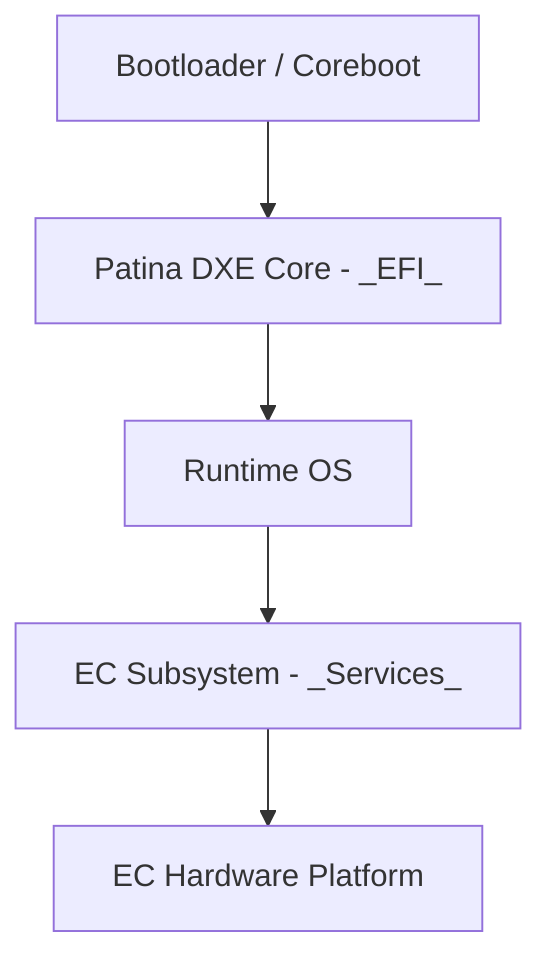

# ODP Integrator Track Overview
The Integrator track is designed for individuals who are interested in integrating various components and systems within the Open Device Partnership (ODP) framework. This track focuses on the design, implementation, and testing of integration solutions that ensure seamless interoperability between different ODP components. Participants will learn how to create robust integration solutions that enhance system functionality, improve performance, and ensure reliability across ODP implementations.

