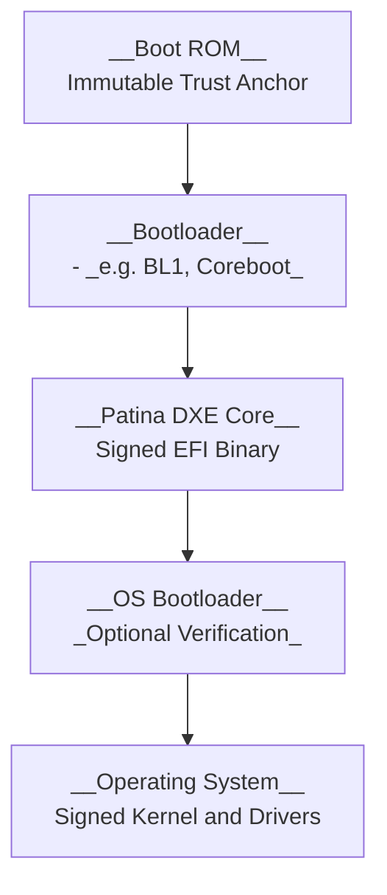
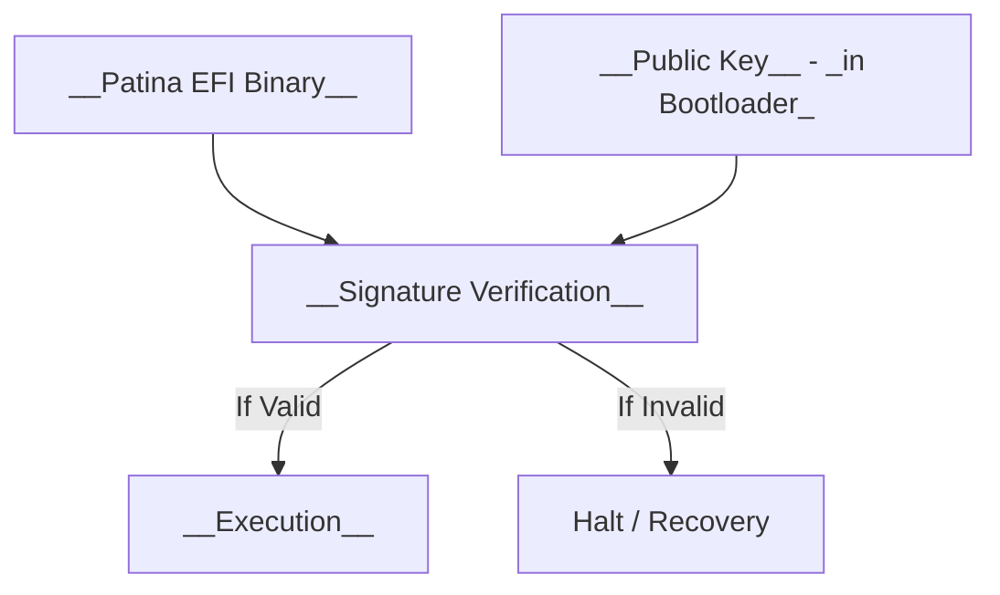

# Secure Boot Architecture

__Secure Boot__ is a cryptographically enforced boot validation mechanism that ensures each stage of system initialization is authenticated and unmodified. Its goal is to prevent unauthorized firmware or operating systems from executing on the platform.

> __Figure: Secure Boot Chain of Trust__
>
> Each stage validates the integrity and authenticity of the next using cryptographic signatures or measured hashes. Patina fits into this chain as the DXE-phase firmware payload, typically signed and validated prior to execution.

## Role of Patina in Secure Boot

1. The DXE Core produced by Patina is signed and stored as an .efi binary.
2. The platform bootloader (coreboot, U-Boot, etc.) or UEFI Secure Boot loader validates the Patina payload before execution.
3. Patina itself does not contain its own secure bootloader but is designed to be a signed leaf node in a secure boot chain.

On platforms with measured boot (e.g., DRTM or TPM-backed environments), Patina binaries can also be hashed and extended into a PCR register.

## Signature and Validation Workflow

A secure boot process is only one part of the platform's trust chain.  To preserve integrity after boot, Firmware Updates must be signed and verified, and Runtime E access must be validated and isolated.

