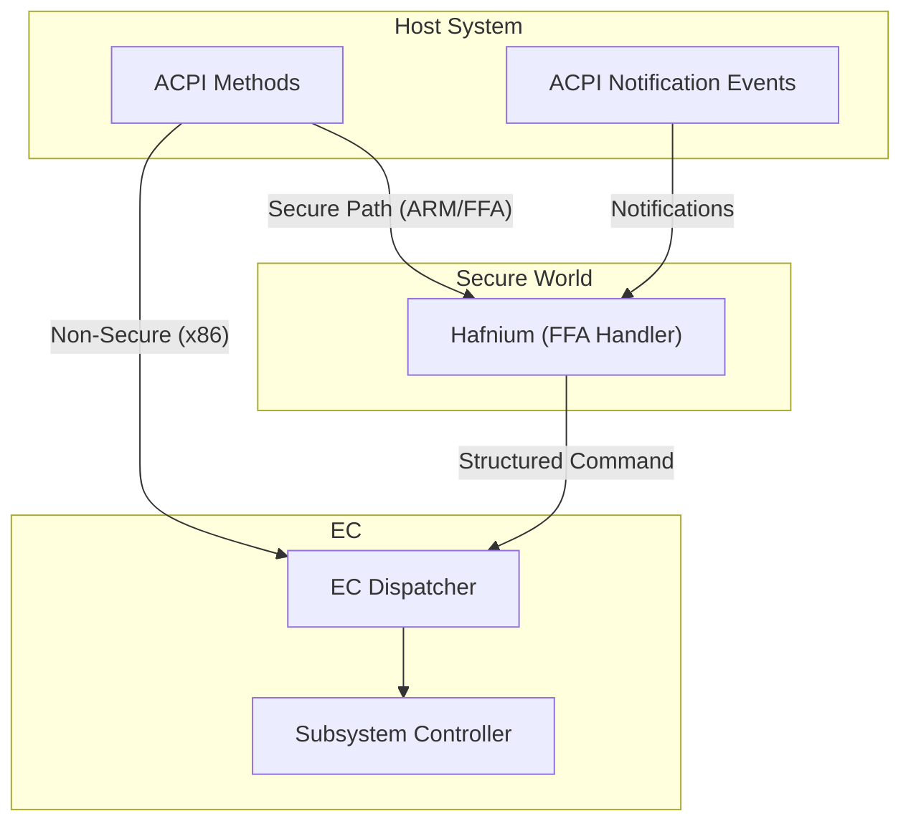

# Secure EC Services

> __Figure: Host–EC Communication Paths__
>
> The host communicates with the EC via __ACPI__ calls and notification events. On __ARM__ platforms with secure world enforcement, messages are routed through __Hafnium__ via __FF-A__ interfaces. On __x86__ platforms, communication is direct. The EC dispatcher then forwards commands to appropriate subsystem controllers.
