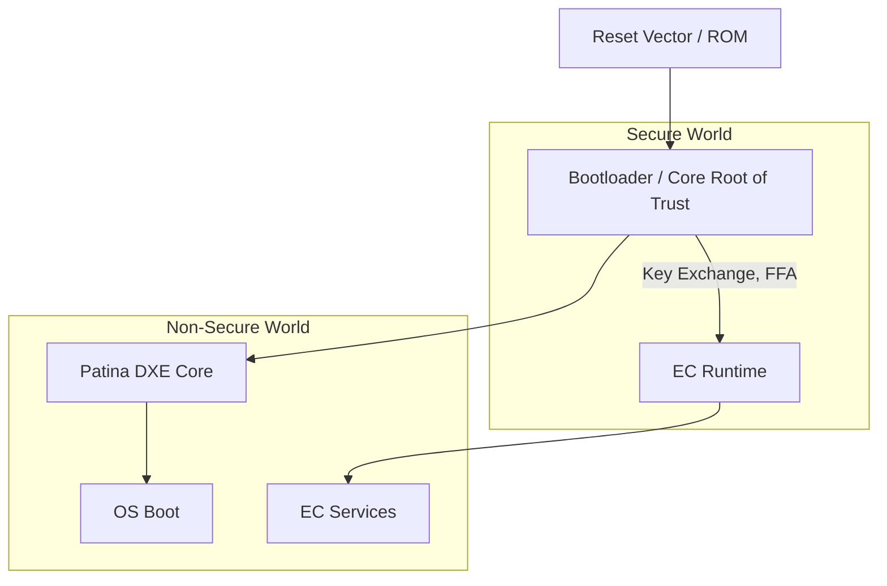

# ODP Security Architecture

Whether in the Patina or Embedded Controller domain, ODP's security architecture is designed to ensure the integrity and trustworthiness of firmware components. This architecture is built upon several key principles:

- __Least Privilege__: Components operate with the minimum privileges necessary to perform their functions, reducing the risk of unauthorized access or damage.
- __Isolation__: Components are isolated from one another to prevent unintended interactions and to contain potential security breaches.
- __Verification__: Components are verified at boot time to ensure they have not been tampered with and that they meet the expected security standards. 
- __Layered Defense__: Security concerns are enforced at multiple levels — bootloader, firmware, EC messaging, and runtime service dispatch.

> __Figure: System Trust Boundaries__
>
> The ODP system defines strong isolation between secure and non-secure execution. Firmware integrity is established early and extended to runtime services. EC services may operate in either domain, depending on platform architecture.

| Area                | Concerns                                 | Enforced By                            |
| ------------------- | ---------------------------------------- | -------------------------------------- |
| **Secure Boot**     | Root trust, signed firmware, measurement | Bootloader / Patina                    |
| **Firmware Update** | Verification, rollback protection        | Update agent, signing keys             |
| **EC Services**     | Isolation, message auth, FF-A routing    | Hafnium, UUID filtering, runtime logic |
