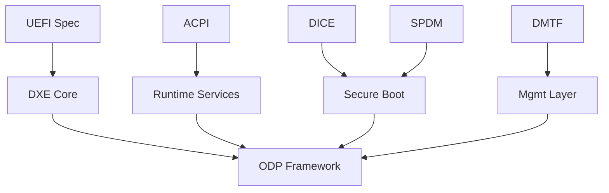

# Alignment with Industry Trends and Standards

ODP is forward-facing from its original concept, and embodied in its design.  Adoption of ODP positions you at the forefront of secure, future-facing firmware innovation.

> _“ODP doesn’t rewrite the rules — it implements them with confidence.”_

### Perfectly Timed
ODP taps into the growing ecosystem momentum around Rust and embedded standards. Rust adoption at Microsoft, Google, and the Linux kernel reflects a broader industry shift.

### Open Source and Collaborative
ODP Encourages upstream contributions and compliance with modern firmware interfaces (UEFI, ACPI, DICE).

An open collaboration model invites cross-vendor reuse and innovation while building upon existing standards known to the industry.

